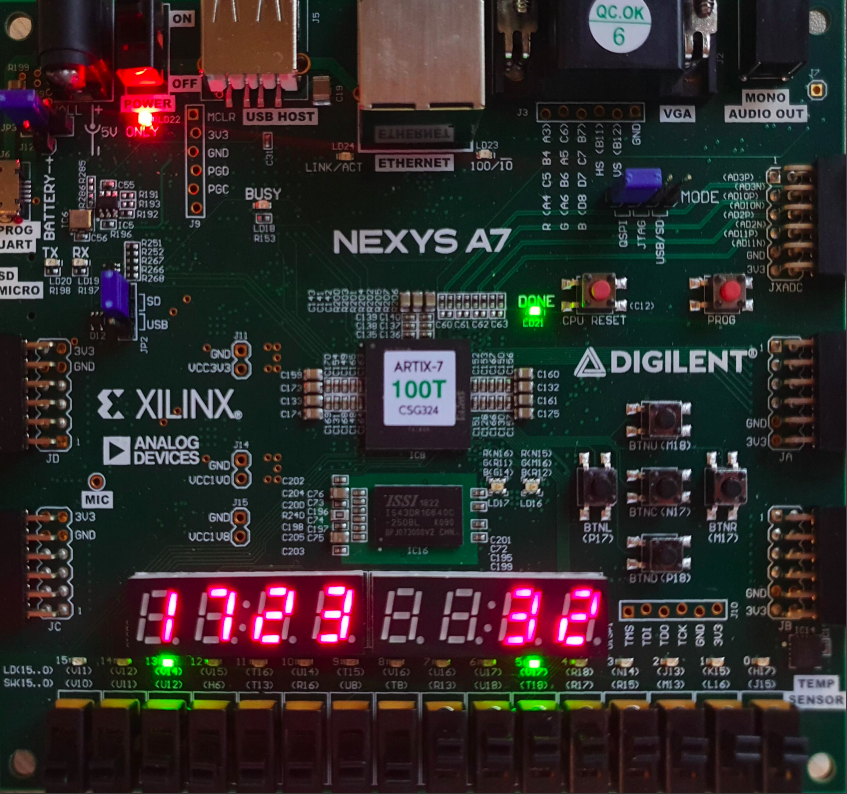
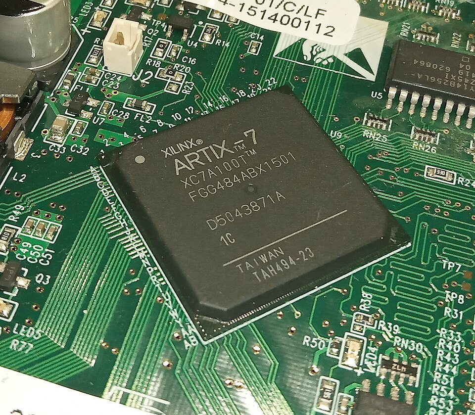
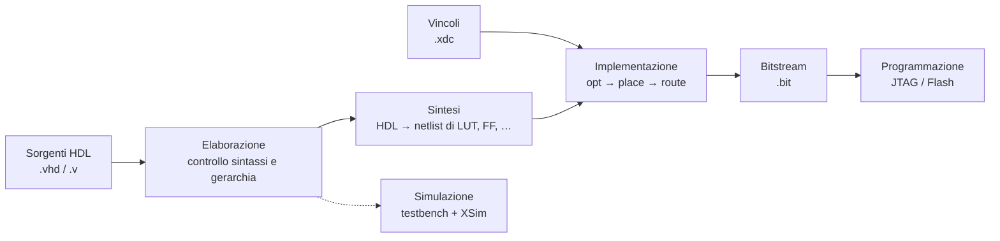

# Guida alla Digilent Nexys A7 (Artix-7)

Guida pratica e teorica per usare la **Digilent Nexys A7** con **Vivado 2023.1** (edizione gratuita ML Standard) e per portare sulla scheda i circuiti del corso (mux, full adder, ripple-carry adder, contatore modulo 16, …).



---

## Indice

1. [Cos'è la Nexys A7](#1-cosè-la-nexys-a7)
2. [Teoria: cos'è un FPGA e come è fatto un Artix-7](#2-teoria-cosè-un-fpga-e-come-è-fatto-un-artix-7)
3. [La scheda nel dettaglio](#3-la-scheda-nel-dettaglio)
4. [Toolchain: cosa installare](#4-toolchain-cosa-installare)
5. [Flusso di progetto in Vivado, passo passo](#5-flusso-di-progetto-in-vivado-passo-passo)
6. [Il file dei vincoli (XDC)](#6-il-file-dei-vincoli-xdc)
7. [Regole d'oro per portare un circuito sulla scheda](#7-regole-doro-per-portare-un-circuito-sulla-scheda)
8. [Esempi di integrazione dei circuiti del corso](#8-esempi-di-integrazione-dei-circuiti-del-corso)
9. [Simulazione con testbench](#9-simulazione-con-testbench)
10. [Programmazione persistente (Flash QSPI, USB, microSD)](#10-programmazione-persistente-flash-qspi-usb-microsd)
11. [Flusso da riga di comando (Tcl, senza GUI)](#11-flusso-da-riga-di-comando-tcl-senza-gui)
12. [Andare oltre: UART, VGA, MicroBlaze](#12-andare-oltre-uart-vga-microblaze)
13. [Risoluzione dei problemi](#13-risoluzione-dei-problemi)
14. [Riferimenti](#14-riferimenti)

---

## 1. Cos'è la Nexys A7

La **Nexys A7** è una *development board* prodotta da **Digilent** (oggi parte di Emerson/NI) attorno a un **FPGA AMD/Xilinx Artix-7**. È pensata per la didattica: ha molte periferiche già collegate all'FPGA (switch, LED, display, pulsanti, VGA, audio, sensori, Ethernet, …) in modo da poter provare subito i circuiti digitali progettati in VHDL/Verilog senza dover cablare nulla.

Esistono due varianti, che differiscono **solo per l'FPGA montato**:

| Variante        | FPGA                 | Part number Vivado     | Note                                |
|-----------------|----------------------|------------------------|-------------------------------------|
| Nexys A7-**100T** | Artix-7 XC7A100T   | `xc7a100tcsg324-1`     | la più diffusa (quella della foto)  |
| Nexys A7-**50T**  | Artix-7 XC7A50T    | `xc7a50ticsg324-1L`    | metà risorse logiche                |

> **Come capire quale hai:** guarda la scritta sul chip centrale: `ARTIX-7 100T` oppure `50T`. In tutta la guida si assume la **100T**; per la 50T basta cambiare il *part number*.

> **Nexys 4 DDR = Nexys A7.** La Nexys A7 è la Nexys 4 DDR rinominata, senza modifiche sostanziali: tutorial, progetti e file di vincoli della Nexys 4 DDR funzionano anche qui.

### Cosa si può fare con la scheda

- **Logica combinatoria** (mux, decoder, sommatori): ingressi dagli switch, uscite sui LED e sul display.
- **Logica sequenziale** (contatori, registri, macchine a stati) con il clock a 100 MHz della scheda.
- **Sistemi più complessi**: comunicazione seriale col PC (UART), grafica su monitor VGA, audio, lettura di sensori, un processore *soft-core* (MicroBlaze o RISC-V) sintetizzato dentro l'FPGA.

---

## 2. Teoria: cos'è un FPGA e come è fatto un Artix-7

### 2.1 FPGA in una frase

Un **FPGA** (*Field Programmable Gate Array*) è un chip che contiene una grande matrice di **blocchi logici configurabili** e di **interconnessioni programmabili**. Caricandoci un file di configurazione (il **bitstream**) si decide *che circuito diventa* il chip. Non esegue istruzioni come una CPU: **è** il circuito che descrivi.

| | Microcontrollore / CPU | FPGA | ASIC |
|---|---|---|---|
| Cosa programmi | una sequenza di istruzioni | la struttura dell'hardware | nulla, è fisso |
| Parallelismo | limitato (1 istruzione alla volta per core) | totale: tutti i blocchi lavorano insieme | totale |
| Linguaggio | C, assembly, … | **HDL** (VHDL, Verilog) | HDL |
| Modificabile | sì | sì (riconfigurabile) | no |

Punto chiave per chi viene dalla programmazione: **un HDL descrive hardware**. Ogni `process` o ogni assegnazione concorrente diventa un pezzo di circuito che lavora *contemporaneamente* a tutti gli altri.

### 2.2 Gli elementi di un Artix-7 (serie 7 di Xilinx)



| Elemento | Cosa fa | Dove finisce il tuo circuito |
|---|---|---|
| **LUT6** (*Look-Up Table* a 6 ingressi) | una piccola memoria da 64 bit che implementa **qualsiasi** funzione booleana di 6 variabili | porte logiche, mux, XOR del full adder, … |
| **Flip-flop (FF)** | elemento di memoria da 1 bit sincrono al clock | registri, contatori, stato delle FSM |
| **Carry chain (CARRY4)** | catena di propagazione del riporto veloce e dedicata | sommatori, contatori, comparatori |
| **Slice** | 4 LUT6 + 8 FF + 1 CARRY4 + mux interni | unità base di logica |
| **CLB** (*Configurable Logic Block*) | 2 slice | |
| **SLICEM** | slice le cui LUT possono fare anche da piccola RAM o shift register | memorie distribuite |
| **Block RAM (BRAM)** | RAM dual-port da 36 Kb (o 2×18 Kb) | memorie, FIFO, ROM |
| **DSP48E1** | moltiplicatore 25×18 + accumulatore | moltiplicazioni, filtri |
| **CMT** (MMCM + PLL) | generatori/sintetizzatori di clock | creare clock a frequenze diverse da 100 MHz |
| **BUFG** / rete di clock globale | distribuisce il clock a tutto il chip con skew minimo | il segnale `clk` |
| **IOB** (*I/O Block*) e **banchi di I/O** | interfaccia fisica con i pin; ogni banco ha una tensione (1.8 V, 3.3 V, …) | le porte della tua *entity top* |
| **XADC** | convertitore analogico-digitale 12 bit, 1 MSPS | letture analogiche (porta JXADC) |

Risorse dei due chip:

| Risorsa | XC7A**100T** | XC7A**50T** |
|---|---|---|
| Slice | 15 850 | 8 150 |
| LUT6 | 63 400 | 32 600 |
| Flip-flop | 126 800 | 65 200 |
| Block RAM (36 Kb) | 135 (4 860 Kb) | 75 (2 700 Kb) |
| DSP48E1 | 240 | 120 |
| CMT | 6 | 5 |

Per dare un'idea: un full adder usa 1–2 LUT, un RCA a 8 bit una decina di LUT (o una CARRY4 e qualche LUT), un contatore mod 16 4 FF. I circuiti del corso occupano **ben meno dell'1%** del chip.

### 2.3 Configurazione: FPGA a SRAM

La configurazione dell'Artix-7 è memorizzata in celle **SRAM**, che sono **volatili**: quando togli l'alimentazione la scheda "dimentica" il circuito. Per questo esistono due modi di caricarlo:

- **JTAG** (via USB dal PC): veloce, per lo sviluppo; si perde allo spegnimento.
- **Da memoria non volatile**: la scheda ha una Flash **Quad-SPI** da cui l'FPGA si auto-configura all'accensione (vedi [§10](#10-programmazione-persistente-flash-qspi-usb-microsd)); in alternativa una chiavetta USB o una microSD.

### 2.4 Dal codice al bitstream



| Fase | Cosa succede | Errori tipici |
|---|---|---|
| **Elaborazione** | Vivado legge l'HDL, risolve la gerarchia e i `generic` | errori di sintassi, entity non trovata |
| **Sintesi** | traduce la descrizione in *primitive* dell'FPGA (LUT, FF, CARRY4, BRAM, …) | latch involontari, segnali con più driver |
| **Implementazione** | *place*: sceglie **dove** mettere ogni primitiva; *route*: collega tutto con le interconnessioni | pin non vincolati, vincoli di timing violati |
| **Bitstream** | genera il file `.bit` che configura il chip | DRC `NSTD-1` / `UCIO-1` (pin senza vincolo) |
| **Programmazione** | invia il `.bit` al chip | scheda non vista, driver mancanti |

### 2.5 Timing in due righe

Ogni percorso tra due flip-flop deve stabilizzarsi **entro un periodo di clock**, tenendo conto dei tempi di **setup** e **hold** dei FF. Con clock a 100 MHz il periodo è 10 ns. Dopo l'implementazione Vivado riporta:

- **WNS** (*Worst Negative Slack*): il margine del percorso peggiore. **Se è ≥ 0 il timing è rispettato.**
- **TNS** (*Total Negative Slack*): la somma dei margini negativi; deve essere 0.
- **WHS / THS**: gli equivalenti per il tempo di hold.

Perché Vivado possa fare questa analisi deve sapere la frequenza del clock: serve il vincolo `create_clock` nel file XDC (vedi [§6](#6-il-file-dei-vincoli-xdc)).

---

## 3. La scheda nel dettaglio

### 3.1 Componenti principali

| Componente | Chip / caratteristiche | Uso tipico |
|---|---|---|
| **FPGA** | Artix-7 XC7A100T-1CSG324C | il tuo circuito |
| **Clock** | oscillatore **100 MHz** sul pin `E3` | clock di sistema |
| **Memoria DDR2** | 128 MiB (Micron MT47H64M16HR) | richiede l'IP *MIG*, per progetti avanzati |
| **Flash Quad-SPI** | 16 MiB (Spansion/Infineon S25FL128S) | bitstream persistente, dati |
| **USB-JTAG/UART** | FTDI FT2232HQ, micro-USB **PROG UART** | programmazione **e** porta seriale col PC (stesso cavo) |
| **USB host** | Microchip PIC24FJ128, connettore USB-A | tastiera/mouse (emulati PS/2) o chiavetta con il bitstream |
| **Ethernet** | PHY SMSC LAN8720A 10/100, interfaccia RMII | rete |
| **VGA** | DB-15, 12 bit colore (4 R + 4 G + 4 B) tramite DAC a resistenze | uscita video |
| **Audio out** | jack 3.5 mm mono, PWM + filtro + amplificatore | suoni e toni |
| **Microfono** | MEMS ADMP421, uscita **PDM** | acquisizione audio |
| **Accelerometro** | ADXL362 a 3 assi, **SPI** | inclinazione e movimento |
| **Sensore di temperatura** | ADT7420, **I²C** | temperatura |
| **Slot microSD** | sotto la scheda | dati o bitstream |
| **Pmod** | 4 connettori da 12 pin (**JA, JB, JC, JD**) + **JXADC** (ingressi analogici) | moduli di espansione, strumenti di misura |

### 3.2 I/O "semplici" (quelli che userai di più)

| Periferica | Quantità | Logica | Nome nel file XDC |
|---|---|---|---|
| Switch | 16 | alto = `'1'` (switch verso l'alto) | `SW[0]` … `SW[15]` |
| LED | 16 | **attivi alti** (`'1'` = acceso) | `LED[0]` … `LED[15]` |
| LED RGB | 2 | attivi alti, uno per ogni colore | `LED16_R/G/B`, `LED17_R/G/B` |
| Pulsanti | 5 | **attivi alti** (premuto = `'1'`) | `BTNC`, `BTNU`, `BTND`, `BTNL`, `BTNR` |
| Pulsante CPU RESET | 1 | **attivo basso** (premuto = `'0'`) | `CPU_RESETN` |
| Display 7 segmenti | 8 cifre | anodo comune, **segmenti e anodi attivi bassi** | `CA`…`CG`, `DP`, `AN[0]`…`AN[7]` |

> L'indice 0 è sempre **a destra**: `SW[0]`/`LED[0]` sono i più a destra, `AN[0]` è la cifra più a destra del display.

> **Attenzione:** `SW[8]` e `SW[9]` sono su un banco a **1.8 V** e nel file XDC vogliono `IOSTANDARD LVCMOS18`, a differenza di tutti gli altri (`LVCMOS33`). Il file master Digilent lo imposta già correttamente.

> **Il pulsante PROG non è un ingresso utente:** cancella la configurazione dell'FPGA e la ricarica secondo la modalità del jumper JP1. Il pulsante `CPU RESET` invece è un normale ingresso a disposizione del tuo circuito.

### 3.3 Il display a 7 segmenti

```
      ─── a ───
     │         │
     f         b
     │         │
      ─── g ───
     │         │
     e         c
     │         │
      ─── d ───   ● dp
```

Le 8 cifre **condividono gli stessi 8 segnali di catodo** (`CA`…`CG`, `DP`); ogni cifra ha il suo **anodo** (`AN[i]`). Quindi:

- `AN[i] = '0'` accende la cifra *i*, `AN[i] = '1'` la spegne;
- `CA = '0'` accende il segmento *a* di **tutte** le cifre attive in quel momento.

Per mostrare cifre **diverse** bisogna fare **multiplexing nel tempo**: si accende una cifra alla volta, con il suo valore, e si passa alla successiva ogni ~1 ms. Oltre ~60 Hz di refresh complessivo l'occhio vede tutte le cifre accese insieme (persistenza della visione). Un driver pronto è in [§8.3](#83-driver-per-il-display-a-7-segmenti-riusabile).

### 3.4 Alimentazione, jumper e pulsanti di sistema

| Elemento | Funzione |
|---|---|
| **Interruttore POWER** | accende/spegne la scheda |
| **JP3** (vicino al jack) | sceglie la sorgente: USB (dal cavo PROG UART), alimentatore esterno (**solo 5 V**, "5V ONLY") o batteria |
| **JP1 – MODE** | da dove si configura l'FPGA all'accensione o premendo PROG: **JTAG** · **QSPI** (Flash) · **USB/SD** |
| **JP2** | con JP1 su USB/SD, sceglie tra **USB** (chiavetta) e **SD** (microSD) |
| **PROG** | forza la riconfigurazione |
| **LED DONE** | acceso = FPGA configurato correttamente |

Per lo sviluppo quotidiano basta **il solo cavo micro-USB** nella porta **PROG UART**: alimenta la scheda, la programma e fa da porta seriale.

### 3.5 Pmod

I connettori Pmod (JA–JD) hanno 12 pin: 8 segnali, 2 GND e 2 VCC (3.3 V). Nel file XDC i segnali sono numerati `JA[1]`–`JA[4]` e `JA[7]`–`JA[10]` (i pin 5-6 e 11-12 sono alimentazione). Sono utili per collegare moduli esterni o un **analizzatore logico/oscilloscopio** (es. Digilent Analog Discovery) per osservare i segnali del tuo circuito.

> I pin Pmod lavorano a **3.3 V** e non sono protetti contro i 5 V: non collegarci segnali a 5 V.

---

## 4. Toolchain: cosa installare

### 4.1 Vivado 2023.1 (obbligatorio)

La **Vivado ML Standard Edition** (ex WebPACK) è **gratuita** e supporta completamente sia l'XC7A100T sia l'XC7A50T. Non serve alcuna licenza.

In fase di installazione:

1. Prodotto: **Vivado** → edizione **Vivado ML Standard**.
2. Dispositivi: basta **7 Series → Artix-7** (deselezionare il resto risparmia molti GB).
3. Spuntare **"Install Cable Drivers"**: sono i driver USB necessari per programmare la scheda.
4. Percorso: preferibilmente **senza spazi** (es. `C:\Xilinx`). Anche i tuoi progetti è meglio tenerli in percorsi senza spazi né caratteri accentati: Vivado ha problemi noti con entrambi.

Se in seguito la scheda non viene riconosciuta, i driver si possono reinstallare **da amministratore** con:

```powershell
C:\Xilinx\Vivado\2023.1\data\xicom\cable_drivers\nt64\install_drivers_wrapper.bat
```

Vivado include già tutto il necessario: editor, **simulatore XSim**, sintesi, implementazione e **Hardware Manager** per programmare la scheda.

### 4.2 Board files Digilent (consigliati)

I *board files* descrivono la scheda a Vivado (part number, clock, periferiche) e permettono di selezionare direttamente "Nexys A7-100T" invece del solo chip. Sono **indispensabili** se userai il *Block Design* (MicroBlaze, IP con interfacce di scheda); per i progetti puramente HDL è sufficiente scegliere il part number.

Due modi per installarli:

- **Dalla GUI (più semplice):** in *Create Project → Default Part → Boards*, premi **Refresh** in basso a sinistra (Xilinx Board Store), cerca *Nexys A7* e clicca l'icona di download.
- **Manuale:** scarica il repository [Digilent/vivado-boards](https://github.com/Digilent/vivado-boards) e copia il contenuto di `new/board_files/` in `C:\Xilinx\Vivado\2023.1\data\boards\board_files\` (crea la cartella se non esiste). Riavvia Vivado.

### 4.3 File dei vincoli master (obbligatorio, di fatto)

Scarica il file **[Nexys-A7-100T-Master.xdc](https://github.com/Digilent/digilent-xdc/blob/master/Nexys-A7-100T-Master.xdc)** (o la versione `50T`) dal repository [Digilent/digilent-xdc](https://github.com/Digilent/digilent-xdc). Contiene l'assegnazione di **tutti** i pin della scheda, commentata: la si copia nel progetto e si decommentano solo le righe che servono (vedi [§6](#6-il-file-dei-vincoli-xdc)).

### 4.4 Strumenti opzionali

| Strumento | Serve per | Quando |
|---|---|---|
| **Vitis 2023.1** (gratuito) | scrivere software C per un processore MicroBlaze sintetizzato nell'FPGA | solo per progetti con soft-core |
| **PuTTY** / **Tera Term** / monitor seriale di VS Code | comunicare via **UART** col circuito (la COM appare quando colleghi la scheda) | progetti con seriale |
| **VS Code** + estensione **TerosHDL** o **VHDL LS** | editing HDL con evidenziazione, controllo errori, navigazione | comodità |
| **GHDL** + **GTKWave** | simulazione VHDL leggera fuori da Vivado | alternativa veloce a XSim |
| **Digilent Adept 2** | utility Digilent per programmare e testare la scheda | non necessaria: Vivado basta |
| **openFPGALoader** | programmare il `.bit` da riga di comando senza Vivado | alternativa leggera |
| **Digilent WaveForms** + Analog Discovery | oscilloscopio / analizzatore logico sui Pmod | debug di segnali reali |

### 4.5 Vivado e Git

Un progetto Vivado genera molti file intermedi. Conviene versionare **solo i sorgenti** (`.vhd`, `.v`, `.xdc`, testbench, script Tcl) e ignorare le cartelle generate:

```gitignore
# Vivado
*.cache/
*.hw/
*.ip_user_files/
*.runs/
*.sim/
*.gen/
.Xil/
*.jou
*.str
*.wdb
*.bit
*.mcs
*.prm
```

Il modo più pulito per ricreare un progetto è uno **script Tcl** (vedi [§11](#11-flusso-da-riga-di-comando-tcl-senza-gui)), oppure *File → Project → Write Tcl* in Vivado.

---

## 5. Flusso di progetto in Vivado, passo passo

### 5.1 Creare il progetto

1. **File → Project → New… → Next.**
2. Nome e cartella del progetto (niente spazi). Lascia spuntato *Create project subdirectory*.
3. **RTL Project**. Puoi spuntare *Do not specify sources at this time* e aggiungerli dopo.
4. **Default Part:** scheda *Boards* → **Nexys A7-100T** (se hai installato i board files) oppure scheda *Parts* → `xc7a100tcsg324-1`.
5. Imposta **Target language: VHDL** (o Verilog) in *Settings → General*: influisce sui template e sui file generati.

### 5.2 Aggiungere sorgenti e vincoli

- **Add Sources** (`Alt+A`) → *Add or create design sources*: i tuoi `.vhd` (circuiti + top-level).
- **Add Sources** → *Add or create constraints*: il file `.xdc` (copia del master, modificata).
- **Add Sources** → *Add or create simulation sources*: i testbench.

Nel pannello *Sources* il **top module** è in grassetto; se Vivado non sceglie quello giusto: tasto destro → **Set as Top**.

> Spunta *Copy sources into project* **solo** se vuoi una copia separata. Se tieni i sorgenti in `esercitazioni/src/`, non spuntarla: Vivado userà i file originali e le modifiche finiranno direttamente nella repo.

### 5.3 Simulare (prima di andare sulla scheda!)

*Flow Navigator → Simulation → **Run Simulation → Run Behavioral Simulation***. Si apre XSim con le forme d'onda. È molto più facile trovare un errore in simulazione che sulla scheda. Vedi [§9](#9-simulazione-con-testbench).

### 5.4 Sintesi, implementazione, bitstream

Nel *Flow Navigator*:

1. **Run Synthesis** → alla fine controlla i *Messages*: i **Critical Warning** vanno sempre letti.
2. **Run Implementation**.
3. **Generate Bitstream** (lancia da solo anche i passi precedenti se servono).

Report utili (*Open Implemented Design*):

- **Report Utilization**: quante LUT/FF/BRAM usi.
- **Report Timing Summary**: controlla che **WNS ≥ 0** (vedi [§2.5](#25-timing-in-due-righe)).
- **Schematic** (dopo la sintesi): mostra il circuito ottenuto. Ottimo per verificare che ciò che hai scritto corrisponda a ciò che volevi (es. niente latch).

### 5.5 Programmare la scheda (JTAG)

1. Collega il cavo micro-USB alla porta **PROG UART**, accendi (POWER su ON). JP1 può stare in qualsiasi posizione per il JTAG.
2. *Flow Navigator → **Open Hardware Manager*** → **Open Target → Auto Connect**.
3. Compare `xc7a100t_0`: tasto destro → **Program Device** → seleziona il `.bit` (di solito in `<progetto>.runs/impl_1/<top>.bit`) → **Program**.
4. Il LED **DONE** si accende e il circuito è attivo.

---

## 6. Il file dei vincoli (XDC)

Il file **XDC** (*Xilinx Design Constraints*, sintassi Tcl) dice a Vivado:

1. **a quale pin fisico** corrisponde ogni porta della entity top (`PACKAGE_PIN`);
2. **con quale standard elettrico** (`IOSTANDARD`, qui quasi sempre `LVCMOS33`);
3. **a che frequenza va il clock** (`create_clock`), per l'analisi di timing;
4. opzioni di configurazione del chip (tensione, Flash, …).

### 6.1 Anatomia di una riga

```tcl
set_property -dict { PACKAGE_PIN J15   IOSTANDARD LVCMOS33 } [get_ports { SW[0] }];
#                    └ pin del chip    └ standard elettrico              └ nome della porta nell'HDL
```

- Il nome dentro `get_ports` deve coincidere **esattamente** con la porta della entity top. Una porta VHDL `SW : in std_logic_vector(15 downto 0)` corrisponde a `SW[0]` … `SW[15]` nell'XDC.
- Nel master Digilent tutte le righe sono commentate con `#`: **decommenta solo quelle delle porte che usi**. Se decommenti una riga di una porta che non esiste nel tuo HDL ottieni un *Critical Warning*; se lasci una porta senza vincolo la generazione del bitstream **fallisce** (DRC `UCIO-1` / `NSTD-1`).
- Puoi rinominare le porte nell'XDC (es. `SW[0]` → `a`), ma usare i nomi del master rende tutto più leggibile e riutilizzabile.

### 6.2 Il clock

```tcl
set_property -dict { PACKAGE_PIN E3    IOSTANDARD LVCMOS33 } [get_ports { CLK100MHZ }];
create_clock -add -name sys_clk_pin -period 10.00 -waveform {0 5} [get_ports { CLK100MHZ }];
```

`-period 10.00` = 10 ns = 100 MHz. Senza `create_clock` Vivado non verifica il timing del circuito sequenziale.

### 6.3 Opzioni di configurazione consigliate

Da aggiungere in fondo a ogni XDC: eliminano un warning ricorrente e sono necessarie per la Flash ([§10](#10-programmazione-persistente-flash-qspi-usb-microsd)):

```tcl
set_property CONFIG_VOLTAGE 3.3 [current_design]
set_property CFGBVS VCCO [current_design]
set_property BITSTREAM.GENERAL.COMPRESS TRUE [current_design]
set_property BITSTREAM.CONFIG.CONFIGRATE 33 [current_design]
set_property CONFIG_MODE SPIx4 [current_design]
set_property BITSTREAM.CONFIG.SPI_BUSWIDTH 4 [current_design]
```

### 6.4 Tabella pin di riferimento (Nexys A7-100T)

Estratta dal master XDC Digilent (tutti `LVCMOS33` salvo dove indicato):

| Porta | Pin | | Porta | Pin | | Porta | Pin |
|---|---|---|---|---|---|---|---|
| `CLK100MHZ` | E3 | | `LED[0]` | H17 | | `CA` | T10 |
| `CPU_RESETN` | C12 | | `LED[1]` | K15 | | `CB` | R10 |
| `BTNC` | N17 | | `LED[2]` | J13 | | `CC` | K16 |
| `BTNU` | M18 | | `LED[3]` | N14 | | `CD` | K13 |
| `BTNL` | P17 | | `LED[4]` | R18 | | `CE` | P15 |
| `BTNR` | M17 | | `LED[5]` | V17 | | `CF` | T11 |
| `BTND` | P18 | | `LED[6]` | U17 | | `CG` | L18 |
| `SW[0]` | J15 | | `LED[7]` | U16 | | `DP` | H15 |
| `SW[1]` | L16 | | `LED[8]` | V16 | | `AN[0]` | J17 |
| `SW[2]` | M13 | | `LED[9]` | T15 | | `AN[1]` | J18 |
| `SW[3]` | R15 | | `LED[10]` | U14 | | `AN[2]` | T9 |
| `SW[4]` | R17 | | `LED[11]` | T16 | | `AN[3]` | J14 |
| `SW[5]` | T18 | | `LED[12]` | V15 | | `AN[4]` | P14 |
| `SW[6]` | U18 | | `LED[13]` | V14 | | `AN[5]` | T14 |
| `SW[7]` | R13 | | `LED[14]` | V12 | | `AN[6]` | K2 |
| `SW[8]` | T8 (**LVCMOS18**) | | `LED[15]` | V11 | | `AN[7]` | U13 |
| `SW[9]` | U8 (**LVCMOS18**) | | `LED16_R/G/B` | N15 / M16 / R12 | | `UART_TXD_IN` | C4 |
| `SW[10]` | R16 | | `LED17_R/G/B` | N16 / R11 / G14 | | `UART_RXD_OUT` | D4 |
| `SW[11]` | T13 | | `JA[1..4]` | C17 D18 E18 G17 | | `AUD_PWM` / `AUD_SD` | A11 / D12 |
| `SW[12]` | H6 | | `JA[7..10]` | D17 E17 F18 G18 | | `VGA_HS` / `VGA_VS` | B11 / B12 |
| `SW[13]` | U12 | | | | | | |
| `SW[14]` | U11 | | | | | | |
| `SW[15]` | V10 | | | | | | |

> Per la Nexys A7-**50T** i pin sono identici, ma usa comunque il suo master XDC.

---

## 7. Regole d'oro per portare un circuito sulla scheda

### 7.1 Separare il circuito dalla scheda: il *wrapper* top-level

Il circuito del corso (es. `full_adder`) **non** deve sapere nulla della scheda: ha porte con nomi "logici" (`a`, `b`, `cin`, …). Si crea poi una **entity top** (`top_full_adder`) che:

- ha come porte **i nomi del file XDC** (`SW`, `LED`, `CLK100MHZ`, …);
- **istanzia** il circuito e collega le porte della scheda a quelle del circuito;
- aggiunge la logica di contorno legata alla scheda (sincronizzatori, debouncer, driver del display, divisori di frequenza).

```
 ┌──────────────────── top_full_adder (porte = nomi XDC) ────────────────────┐
 │                                                                           │
 │  SW(0) ──► a    ┌──────────────┐                                          │
 │  SW(1) ──► b    │  full_adder  │  s    ──► LED(0)                         │
 │  SW(2) ──► cin  │ (del corso)  │  cout ──► LED(1)                         │
 │                 └──────────────┘                                          │
 └───────────────────────────────────────────────────────────────────────────┘
```

Vantaggi: lo stesso circuito si simula, si riusa e si testa senza toccarlo, e cambiare scheda vuol dire cambiare solo il wrapper e l'XDC.

### 7.2 Logica attiva alta/bassa

Controlla sempre la polarità ([§3.2](#32-io-semplici-quelli-che-userai-di-più)): LED, switch e pulsanti sono attivi alti; `CPU_RESETN`, segmenti e anodi del display sono **attivi bassi**. Un display tutto acceso o tutto spento di solito è una polarità invertita.

### 7.3 Un solo clock, e usa i *clock enable*

- Nei circuiti sequenziali usa **sempre** il clock di sistema `CLK100MHZ` e la forma `if rising_edge(clk) then`.
- Per far andare qualcosa "lento" (es. un contatore a 1 Hz, visibile a occhio) **non** generare un nuovo clock dividendo la frequenza con un contatore: genera un **impulso di enable** lungo un ciclo (`tick`) ogni N cicli e fai avanzare il circuito solo quando `tick = '1'`. Il circuito resta sincrono con un unico clock e il timing è analizzabile.
- Se servono davvero frequenze diverse, usa il **Clocking Wizard** (IP che configura un MMCM/PLL), non la logica.
- Non usare **mai** un pulsante o uno switch direttamente come clock.

### 7.4 Ingressi asincroni: sincronizzatori

Switch e pulsanti cambiano **in qualunque istante**, non allineati al clock. Se un FF campiona un segnale che cambia vicino al fronte, può finire in uno stato **metastabile** (né 0 né 1 per un tempo indefinito). La soluzione standard è far passare ogni ingresso asincrono usato da logica sequenziale attraverso **due flip-flop in cascata** (sincronizzatore a 2 FF). Per la logica **puramente combinatoria** (switch → porte → LED) non serve.

### 7.5 Pulsanti: *debouncing*

Un pulsante meccanico, quando viene premuto, "rimbalza" per qualche millisecondo generando decine di transizioni 0/1. Per un contatore che avanza a ogni pressione significa avanzare di 5–20 passi invece di uno. Serve un **debouncer**: il nuovo valore viene accettato solo se rimane stabile per ~10 ms. Il codice è in [§8.5](#85-contatore-modulo-16).

### 7.6 Reset

Il pulsante `CPU_RESETN` è attivo basso: nel top si fa `rst <= not CPU_RESETN`, poi lo si sincronizza con 2 FF. In più, in FPGA i registri possono avere un **valore iniziale** (`signal cnt : unsigned(3 downto 0) := (others => '0');`), che viene caricato alla configurazione: il circuito parte già in uno stato noto.

### 7.7 Niente latch

In un `process` **combinatorio**, ogni segnale assegnato deve ricevere un valore **in tutti i rami** (`if` con `else`, `case` con `when others`), altrimenti la sintesi inferisce un **latch** (warning `Synth 8-327`), quasi sempre un errore. La lista di sensibilità deve contenere tutti i segnali letti.

---

## 8. Esempi di integrazione dei circuiti del corso

Tutti gli esempi sono in **VHDL** (con un'equivalente Verilog in [§8.7](#87-equivalente-verilog)) e seguono lo schema *circuito del corso + wrapper top + XDC*. Una possibile organizzazione dei file in `esercitazioni/`:

```
esercitazioni/
├── src/                      # circuiti del corso + moduli di supporto
│   ├── mux4.vhd
│   ├── full_adder.vhd
│   ├── rca.vhd
│   ├── counter_mod16.vhd
│   ├── ripple_counter4.vhd
│   ├── tick_gen.vhd
│   ├── debouncer.vhd
│   ├── hex7seg.vhd
│   ├── seg7_driver.vhd
│   └── top_*.vhd             # wrapper per la scheda
├── sim/                      # testbench
│   └── tb_*.vhd
└── constr/                   # vincoli
    └── nexys_a7.xdc
```

### 8.1 Multiplexer 4:1 (lab01_mux) — puramente combinatorio

**Circuito del corso** — `mux4.vhd`:

```vhdl
library ieee;
use ieee.std_logic_1164.all;

entity mux4 is
    port (
        d : in  std_logic_vector(3 downto 0);  -- ingressi dati
        s : in  std_logic_vector(1 downto 0);  -- selezione
        y : out std_logic
    );
end entity;

architecture rtl of mux4 is
begin
    with s select
        y <= d(0) when "00",
             d(1) when "01",
             d(2) when "10",
             d(3) when others;
end architecture;
```

**Wrapper per la scheda** — `top_mux4.vhd`. Dati sugli switch 0–3, selezione sugli switch 14–15, uscita su `LED(0)`; i LED 14–15 mostrano la selezione corrente:

```vhdl
library ieee;
use ieee.std_logic_1164.all;

entity top_mux4 is
    port (
        SW  : in  std_logic_vector(15 downto 0);
        LED : out std_logic_vector(15 downto 0)
    );
end entity;

architecture rtl of top_mux4 is
begin
    u_mux : entity work.mux4
        port map (
            d => SW(3 downto 0),
            s => SW(15 downto 14),
            y => LED(0)
        );

    LED(13 downto 1)  <= (others => '0');
    LED(15 downto 14) <= SW(15 downto 14);
end architecture;
```

**Vincoli** — dal master decommenta le righe di `SW[0..15]` e `LED[0..15]` e aggiungi le opzioni di [§6.3](#63-opzioni-di-configurazione-consigliate). Non serve il clock: il circuito è combinatorio.

**Prova:** metti `SW15 SW14 = 1 0` (seleziona `d(2)`): `LED0` segue `SW2`.

### 8.2 Full adder — combinatorio

`full_adder.vhd`:

```vhdl
library ieee;
use ieee.std_logic_1164.all;

entity full_adder is
    port (
        a, b, cin : in  std_logic;
        s, cout   : out std_logic
    );
end entity;

architecture dataflow of full_adder is
begin
    s    <= a xor b xor cin;
    cout <= (a and b) or (cin and (a xor b));
end architecture;
```

`top_full_adder.vhd`:

```vhdl
library ieee;
use ieee.std_logic_1164.all;

entity top_full_adder is
    port (
        SW  : in  std_logic_vector(2 downto 0);   -- SW0 = a, SW1 = b, SW2 = cin
        LED : out std_logic_vector(1 downto 0)    -- LED0 = s, LED1 = cout
    );
end entity;

architecture rtl of top_full_adder is
begin
    u_fa : entity work.full_adder
        port map (
            a    => SW(0),
            b    => SW(1),
            cin  => SW(2),
            s    => LED(0),
            cout => LED(1)
        );
end architecture;
```

Qui le porte sono dichiarate più strette (`SW(2 downto 0)`, `LED(1 downto 0)`), quindi nell'XDC vanno decommentate **solo** `SW[0..2]` e `LED[0..1]`.

**Prova:** percorri la tabella di verità con i tre switch e confrontala con i LED.

### 8.3 Driver per il display a 7 segmenti (riusabile)

Due moduli che conviene tenere sempre in `src/`, perché visualizzare i risultati in esadecimale è molto più comodo che leggerli dai LED.

**Decodificatore esadecimale → 7 segmenti** — `hex7seg.vhd`. L'uscita è ordinata `g f e d c b a` ed è **attiva bassa** come vuole la scheda:

```vhdl
library ieee;
use ieee.std_logic_1164.all;

entity hex7seg is
    port (
        hex : in  std_logic_vector(3 downto 0);
        seg : out std_logic_vector(6 downto 0)   -- (6)=g ... (0)=a, attivi bassi
    );
end entity;

architecture rtl of hex7seg is
begin
    with hex select
        seg <= "1000000" when "0000",  -- 0
               "1111001" when "0001",  -- 1
               "0100100" when "0010",  -- 2
               "0110000" when "0011",  -- 3
               "0011001" when "0100",  -- 4
               "0010010" when "0101",  -- 5
               "0000010" when "0110",  -- 6
               "1111000" when "0111",  -- 7
               "0000000" when "1000",  -- 8
               "0010000" when "1001",  -- 9
               "0001000" when "1010",  -- A
               "0000011" when "1011",  -- b
               "1000110" when "1100",  -- C
               "0100001" when "1101",  -- d
               "0000110" when "1110",  -- E
               "0001110" when others;  -- F
end architecture;
```

**Driver multiplexato a 8 cifre** — `seg7_driver.vhd`. Riceve 8 cifre esadecimali (32 bit, cifra 0 = bit 3..0 = cifra più a destra) e una maschera per spegnere le cifre inutilizzate. Un contatore libero a 20 bit fa girare la cifra attiva: 100 MHz / 2¹⁷ ≈ 763 cambi di cifra al secondo, quindi l'intero display viene ridisegnato ~95 volte al secondo, senza sfarfallio.

```vhdl
library ieee;
use ieee.std_logic_1164.all;
use ieee.numeric_std.all;

entity seg7_driver is
    port (
        clk    : in  std_logic;                      -- 100 MHz
        digits : in  std_logic_vector(31 downto 0);  -- 8 cifre hex, cifra 0 a destra
        enable : in  std_logic_vector(7 downto 0);   -- '1' = cifra accesa
        seg    : out std_logic_vector(6 downto 0);   -- g..a, attivi bassi
        dp     : out std_logic;                      -- punto decimale, attivo basso
        an     : out std_logic_vector(7 downto 0)    -- anodi, attivi bassi
    );
end entity;

architecture rtl of seg7_driver is
    signal refresh : unsigned(19 downto 0) := (others => '0');
    signal sel     : integer range 0 to 7;
    signal nibble  : std_logic_vector(3 downto 0);
begin
    process (clk)
    begin
        if rising_edge(clk) then
            refresh <= refresh + 1;
        end if;
    end process;

    sel <= to_integer(refresh(19 downto 17));

    -- cifra da mostrare in questo istante
    process (sel, digits)
    begin
        nibble <= digits(3 downto 0);
        for i in 0 to 7 loop
            if sel = i then
                nibble <= digits(4*i + 3 downto 4*i);
            end if;
        end loop;
    end process;

    -- un solo anodo attivo (basso) alla volta
    process (sel, enable)
    begin
        an      <= (others => '1');
        an(sel) <= not enable(sel);
    end process;

    u_dec : entity work.hex7seg port map (hex => nibble, seg => seg);

    dp <= '1';  -- punto spento
end architecture;
```

Nel top si collega così (i nomi `CA`…`CG` sono quelli del master XDC):

```vhdl
    u_disp : entity work.seg7_driver
        port map (clk => CLK100MHZ, digits => digits, enable => enable,
                  seg => seg, dp => DP, an => AN);

    CA <= seg(0); CB <= seg(1); CC <= seg(2); CD <= seg(3);
    CE <= seg(4); CF <= seg(5); CG <= seg(6);
```

### 8.4 Ripple-Carry Adder (RCA) a N bit — struttura con `generate`

**Circuito del corso** — `rca.vhd`: N full adder in cascata, con il riporto che "increspa" (*ripple*) dal bit meno significativo al più significativo.

```vhdl
library ieee;
use ieee.std_logic_1164.all;

entity rca is
    generic (N : positive := 4);
    port (
        a, b : in  std_logic_vector(N-1 downto 0);
        cin  : in  std_logic;
        s    : out std_logic_vector(N-1 downto 0);
        cout : out std_logic
    );
end entity;

architecture structural of rca is
    signal c : std_logic_vector(N downto 0);   -- c(i) = riporto entrante nel bit i
begin
    c(0) <= cin;

    gen_fa : for i in 0 to N-1 generate
        fa_i : entity work.full_adder
            port map (a => a(i), b => b(i), cin => c(i), s => s(i), cout => c(i+1));
    end generate;

    cout <= c(N);
end architecture;
```

**Wrapper** — `top_rca.vhd`: sommatore a 8 bit. `A` sugli switch 7–0, `B` sugli switch 15–8, `cin` sul pulsante centrale. Risultato sui LED (`LED(7..0)` = somma, `LED(8)` = riporto) e sul display: `A` sulle cifre 7-6, `B` sulle cifre 5-4, riporto sulla cifra 2 e somma sulle cifre 1-0 (la cifra 3 resta spenta).

```
 Display:   [A1][A0] [B1][B0] [  ][co] [S1][S0]
 Cifra:       7   6    5   4    3   2    1   0
```

```vhdl
library ieee;
use ieee.std_logic_1164.all;

entity top_rca is
    port (
        CLK100MHZ : in  std_logic;
        SW        : in  std_logic_vector(15 downto 0);
        BTNC      : in  std_logic;
        LED       : out std_logic_vector(15 downto 0);
        CA, CB, CC, CD, CE, CF, CG, DP : out std_logic;
        AN        : out std_logic_vector(7 downto 0)
    );
end entity;

architecture rtl of top_rca is
    constant N : positive := 8;
    signal a, b, s : std_logic_vector(N-1 downto 0);
    signal cout    : std_logic;
    signal digits  : std_logic_vector(31 downto 0);
    signal seg     : std_logic_vector(6 downto 0);
begin
    a <= SW(7 downto 0);
    b <= SW(15 downto 8);

    u_rca : entity work.rca
        generic map (N => N)
        port map (a => a, b => b, cin => BTNC, s => s, cout => cout);

    LED(7 downto 0)  <= s;
    LED(8)           <= cout;
    LED(15 downto 9) <= (others => '0');

    digits <= a & b & "0000" & "000" & cout & s;

    u_disp : entity work.seg7_driver
        port map (clk => CLK100MHZ, digits => digits, enable => "11110111",
                  seg => seg, dp => DP, an => AN);

    CA <= seg(0); CB <= seg(1); CC <= seg(2); CD <= seg(3);
    CE <= seg(4); CF <= seg(5); CG <= seg(6);
end architecture;
```

**Vincoli:** decommenta `CLK100MHZ` (con il suo `create_clock`), `SW[0..15]`, `BTNC`, `LED[0..15]`, `CA`…`CG`, `DP`, `AN[0..7]`.

**Da osservare:**
- `0xFF + 0x01` → somma `00`, riporto `1`: il riporto attraversa tutti gli 8 full adder.
- Nel report di timing e nello schematic post-sintesi puoi vedere come Vivado mappa l'RCA: con i full adder descritti a porte logiche userà LUT in cascata; scrivendo invece `s <= std_logic_vector(unsigned(a) + unsigned(b))` userebbe la **carry chain** dedicata (CARRY4), molto più veloce. Un buon spunto di confronto per l'elaborato.

### 8.5 Contatore modulo 16

"Contatore modulo 16 seriale" nel senso del contatore **asincrono** (*ripple counter*: ogni flip-flop è pilotato dall'uscita del precedente) è un classico didattico, ma **su FPGA è una pratica sconsigliata** (vedi [§7.3](#73-un-solo-clock-e-usa-i-clock-enable)). Di seguito ci sono entrambe le versioni: prima quella **sincrona corretta**, poi quella **ripple didattica**, per poterle confrontare.

#### Moduli di supporto

**Generatore di impulsi di enable** — `tick_gen.vhd`: genera un impulso lungo un ciclo di clock `TICK_HZ` volte al secondo.

```vhdl
library ieee;
use ieee.std_logic_1164.all;

entity tick_gen is
    generic (
        CLK_HZ  : positive := 100_000_000;
        TICK_HZ : positive := 1
    );
    port (
        clk, rst : in  std_logic;
        tick     : out std_logic
    );
end entity;

architecture rtl of tick_gen is
    constant MAX : natural := CLK_HZ / TICK_HZ - 1;
    signal cnt   : natural range 0 to MAX := 0;
begin
    process (clk)
    begin
        if rising_edge(clk) then
            tick <= '0';
            if rst = '1' then
                cnt <= 0;
            elsif cnt = MAX then
                cnt  <= 0;
                tick <= '1';
            else
                cnt <= cnt + 1;
            end if;
        end if;
    end process;
end architecture;
```

**Sincronizzatore + debouncer per pulsanti** — `debouncer.vhd`: `btn_out` è il livello pulito, `rise` è un impulso di un ciclo alla pressione.

```vhdl
library ieee;
use ieee.std_logic_1164.all;

entity debouncer is
    generic (
        CLK_HZ    : positive := 100_000_000;
        STABLE_MS : positive := 10
    );
    port (
        clk     : in  std_logic;
        btn_in  : in  std_logic;   -- pulsante grezzo, asincrono
        btn_out : out std_logic;   -- livello stabile
        rise    : out std_logic    -- impulso di 1 ciclo alla pressione
    );
end entity;

architecture rtl of debouncer is
    constant MAX : natural := CLK_HZ / 1000 * STABLE_MS;
    signal sync   : std_logic_vector(1 downto 0) := "00";
    signal stable : std_logic := '0';
    signal prev   : std_logic := '0';
    signal cnt    : natural range 0 to MAX := 0;
begin
    process (clk)
    begin
        if rising_edge(clk) then
            sync <= sync(0) & btn_in;           -- sincronizzatore a 2 FF

            if sync(1) = stable then            -- nessun cambiamento
                cnt <= 0;
            elsif cnt = MAX then                -- diverso e stabile da STABLE_MS
                stable <= sync(1);
                cnt    <= 0;
            else
                cnt <= cnt + 1;
            end if;

            prev <= stable;
        end if;
    end process;

    btn_out <= stable;
    rise    <= stable and not prev;
end architecture;
```

#### Versione A (consigliata) — contatore sincrono con enable

`counter_mod16.vhd`:

```vhdl
library ieee;
use ieee.std_logic_1164.all;
use ieee.numeric_std.all;

entity counter_mod16 is
    port (
        clk, rst, en : in  std_logic;
        q            : out std_logic_vector(3 downto 0);
        tc           : out std_logic                    -- terminal count (q = 15)
    );
end entity;

architecture rtl of counter_mod16 is
    signal cnt : unsigned(3 downto 0) := (others => '0');
begin
    process (clk)
    begin
        if rising_edge(clk) then
            if rst = '1' then
                cnt <= (others => '0');
            elsif en = '1' then
                cnt <= cnt + 1;                 -- 15 + 1 = 0: il modulo 16 è gratis
            end if;
        end if;
    end process;

    q  <= std_logic_vector(cnt);
    tc <= '1' when cnt = 15 else '0';
end architecture;
```

`top_counter.vhd`: con `SW0 = 0` il contatore avanza da solo 2 volte al secondo; con `SW0 = 1` avanza di un passo per ogni pressione di `BTNC`. `CPU RESET` azzera. Il valore compare su `LED(3..0)` e sulla cifra 0 del display, `LED(15)` si accende a 15.

```vhdl
library ieee;
use ieee.std_logic_1164.all;

entity top_counter is
    port (
        CLK100MHZ  : in  std_logic;
        CPU_RESETN : in  std_logic;
        BTNC       : in  std_logic;
        SW         : in  std_logic_vector(0 downto 0);
        LED        : out std_logic_vector(15 downto 0);
        CA, CB, CC, CD, CE, CF, CG, DP : out std_logic;
        AN         : out std_logic_vector(7 downto 0)
    );
end entity;

architecture rtl of top_counter is
    signal rst_sync   : std_logic_vector(1 downto 0) := "11";
    signal rst        : std_logic;
    signal tick, step : std_logic;
    signal en, tc     : std_logic;
    signal q          : std_logic_vector(3 downto 0);
    signal digits     : std_logic_vector(31 downto 0);
    signal seg        : std_logic_vector(6 downto 0);
begin
    -- reset: attivo basso sulla scheda, sincronizzato con 2 FF
    process (CLK100MHZ)
    begin
        if rising_edge(CLK100MHZ) then
            rst_sync <= rst_sync(0) & (not CPU_RESETN);
        end if;
    end process;
    rst <= rst_sync(1);

    u_tick : entity work.tick_gen
        generic map (CLK_HZ => 100_000_000, TICK_HZ => 2)
        port map (clk => CLK100MHZ, rst => rst, tick => tick);

    u_btn : entity work.debouncer
        port map (clk => CLK100MHZ, btn_in => BTNC, btn_out => open, rise => step);

    en <= step when SW(0) = '1' else tick;

    u_cnt : entity work.counter_mod16
        port map (clk => CLK100MHZ, rst => rst, en => en, q => q, tc => tc);

    LED(3 downto 0)  <= q;
    LED(14 downto 4) <= (others => '0');
    LED(15)          <= tc;

    digits <= x"0000000" & q;

    u_disp : entity work.seg7_driver
        port map (clk => CLK100MHZ, digits => digits, enable => "00000001",
                  seg => seg, dp => DP, an => AN);

    CA <= seg(0); CB <= seg(1); CC <= seg(2); CD <= seg(3);
    CE <= seg(4); CF <= seg(5); CG <= seg(6);
end architecture;
```

> In VHDL-93 (il default di Vivado) nella `port map` non si possono scrivere espressioni come `x"0000000" & q`: per questo si passa dal segnale intermedio `digits`. Con i file impostati come **VHDL-2008** (*Source File Properties → Type*) sarebbe permesso.

**Vincoli:** `CLK100MHZ` + `create_clock`, `CPU_RESETN`, `BTNC`, `SW[0]`, `LED[0..15]`, `CA`…`CG`, `DP`, `AN[0..7]`.

**Esperimento utile:** sostituisci `step` con `BTNC` "grezzo" (senza debouncer, nemmeno il fronte: solo `en <= BTNC`). Con `SW0 = 1` il contatore girerà all'impazzata finché tieni premuto, perché `en` resta a 1 per milioni di cicli. Anche usando solo il fronte ma senza debouncing vedrai salti di più passi per pressione. È la dimostrazione pratica di [§7.5](#75-pulsanti-debouncing).

#### Versione B (didattica) — contatore asincrono (ripple)

Ogni stadio è un flip-flop T con T = 1 (commuta a ogni fronte) e il clock di ogni stadio è l'uscita del precedente. Commutando sul **fronte di discesa** dell'uscita precedente si ottiene un contatore **in avanti**.

`ripple_counter4.vhd`:

```vhdl
library ieee;
use ieee.std_logic_1164.all;

entity t_ff is
    port (
        clk, rst : in  std_logic;
        q        : out std_logic
    );
end entity;

architecture rtl of t_ff is
    signal s : std_logic := '0';
begin
    process (clk, rst)
    begin
        if rst = '1' then
            s <= '0';
        elsif falling_edge(clk) then
            s <= not s;                 -- T = 1: commuta sempre
        end if;
    end process;
    q <= s;
end architecture;

library ieee;
use ieee.std_logic_1164.all;

entity ripple_counter4 is
    port (
        clk, rst : in  std_logic;
        q        : out std_logic_vector(3 downto 0)
    );
end entity;

architecture structural of ripple_counter4 is
    signal qi : std_logic_vector(3 downto 0);
begin
    ff0 : entity work.t_ff port map (clk => clk, rst => rst, q => qi(0));

    gen : for i in 1 to 3 generate
        ffi : entity work.t_ff port map (clk => qi(i-1), rst => rst, q => qi(i));
    end generate;

    q <= qi;
end architecture;
```

Nel top il primo stadio va pilotato da un clock **lento**, ottenuto qui (solo a scopo didattico) dividendo il clock di sistema:

```vhdl
    -- clock lento derivato: 100 MHz / (2 * 25_000_000) = 2 Hz   (ANTI-PATTERN su FPGA)
    process (CLK100MHZ)
    begin
        if rising_edge(CLK100MHZ) then
            if div = 24_999_999 then
                div      <= 0;
                slow_clk <= not slow_clk;
            else
                div <= div + 1;
            end if;
        end if;
    end process;

    u_rip : entity work.ripple_counter4
        port map (clk => slow_clk, rst => rst, q => LED(3 downto 0));
```

(con `signal div : natural range 0 to 24_999_999 := 0;` e `signal slow_clk : std_logic := '0';`).

**Funziona** sulla scheda, perché le frequenze sono bassissime, ma Vivado emetterà warning di metodologia (clock generati da logica, percorsi non vincolati) e **non può verificarne il timing**. Perché è sconsigliato:

- i "clock" `slow_clk`, `qi(0)`, `qi(1)`, … viaggiano sulla rete di routing generale, non sulla rete di clock dedicata: skew elevato e ritardi imprevedibili;
- le uscite **non cambiano insieme**: nel passaggio 0111 → 1000 compaiono per qualche ns stati intermedi (0110, 0100, 0000), i cosiddetti *glitch*. Se un'altra logica decodificasse `q = 0000`, vedrebbe un falso impulso;
- ogni stadio aggiunge il suo ritardo: con molti bit la frequenza massima crolla.

È un ottimo argomento da discutere nell'elaborato: confronta lo *schematic* e il *timing report* della versione A e della B.

### 8.6 Mettere tutto insieme in Vivado (checklist)

1. Crea il progetto con part `xc7a100tcsg324-1` ([§5.1](#51-creare-il-progetto)).
2. Aggiungi il circuito del corso, i moduli di supporto usati e il `top_*.vhd`.
3. Aggiungi l'XDC con **solo** le porte del top decommentate + le opzioni di [§6.3](#63-opzioni-di-configurazione-consigliate).
4. Imposta il `top_*` come **Top**.
5. Simula il circuito del corso con il suo testbench ([§9](#9-simulazione-con-testbench)).
6. *Generate Bitstream* → controlla Critical Warning e WNS.
7. *Hardware Manager* → *Program Device*.
8. Verifica sulla scheda con una tabella di prove preparata prima.

Per avere più top-level nello stesso progetto (uno per esercizio) basta cambiare il *Top*; ma ogni top usa porte diverse, quindi conviene avere **un XDC per ogni top** e disabilitare quelli non in uso (tasto destro → *Disable File*), oppure un progetto per esercizio (più semplice con lo script di [§11](#11-flusso-da-riga-di-comando-tcl-senza-gui)).

### 8.7 Equivalente Verilog

Se il corso usa Verilog, lo schema è identico. Full adder e wrapper:

```verilog
module full_adder (
    input  wire a, b, cin,
    output wire s, cout
);
    assign s    = a ^ b ^ cin;
    assign cout = (a & b) | (cin & (a ^ b));
endmodule

module top_full_adder (
    input  wire [2:0] SW,
    output wire [1:0] LED
);
    full_adder u_fa (.a(SW[0]), .b(SW[1]), .cin(SW[2]), .s(LED[0]), .cout(LED[1]));
endmodule
```

Il file XDC è lo stesso.

---

## 9. Simulazione con testbench

Un testbench è una entity **senza porte** che istanzia il circuito (*DUT*, Device Under Test), gli applica gli stimoli e, idealmente, **controlla da solo** i risultati con `assert`. Non viene sintetizzato: va aggiunto come *simulation source*.

### 9.1 Testbench esaustivo per l'RCA — `tb_rca.vhd`

```vhdl
library ieee;
use ieee.std_logic_1164.all;
use ieee.numeric_std.all;

entity tb_rca is
end entity;

architecture sim of tb_rca is
    constant N : positive := 4;
    signal a, b, s   : std_logic_vector(N-1 downto 0);
    signal cin, cout : std_logic;
begin
    dut : entity work.rca
        generic map (N => N)
        port map (a => a, b => b, cin => cin, s => s, cout => cout);

    stim : process
        variable expected : unsigned(N downto 0);
    begin
        for ci in 0 to 1 loop
            for i in 0 to 2**N - 1 loop
                for j in 0 to 2**N - 1 loop
                    a <= std_logic_vector(to_unsigned(i, N));
                    b <= std_logic_vector(to_unsigned(j, N));
                    if ci = 1 then cin <= '1'; else cin <= '0'; end if;
                    wait for 10 ns;

                    expected := to_unsigned(i + j + ci, N + 1);
                    assert (cout & s) = std_logic_vector(expected)
                        report "Errore: " & integer'image(i) & " + " & integer'image(j)
                               & " + " & integer'image(ci)
                        severity error;
                end loop;
            end loop;
        end loop;

        report "Simulazione completata" severity note;
        wait;   -- ferma il processo
    end process;
end architecture;
```

### 9.2 Testbench con clock — `tb_counter_mod16.vhd`

```vhdl
library ieee;
use ieee.std_logic_1164.all;

entity tb_counter_mod16 is
end entity;

architecture sim of tb_counter_mod16 is
    constant T  : time := 10 ns;             -- 100 MHz
    signal clk  : std_logic := '0';
    signal rst  : std_logic := '1';
    signal en   : std_logic := '0';
    signal q    : std_logic_vector(3 downto 0);
    signal tc   : std_logic;
    signal done : boolean := false;
begin
    clk <= not clk after T / 2 when not done;  -- generatore di clock, si ferma a fine test

    dut : entity work.counter_mod16
        port map (clk => clk, rst => rst, en => en, q => q, tc => tc);

    stim : process
    begin
        wait for 3 * T;
        rst <= '0';
        en  <= '1';
        wait for 20 * T;                     -- più di un giro completo: 0..15, 0..3
        en  <= '0';
        wait for 5 * T;                      -- deve restare fermo
        report "Fine simulazione" severity note;
        done <= true;                        -- ferma il clock: senza eventi la simulazione termina
        wait;
    end process;
end architecture;
```

In Vivado: tasto destro sul testbench in *Simulation Sources* → **Set as Top**, poi *Run Behavioral Simulation*. Nella finestra delle onde:

- trascina i segnali interni dalla scheda *Scope* per osservarli;
- seleziona `q` → tasto destro → *Radix → Unsigned* per leggerlo come numero;
- *Run All* (o `run 1 us` nella Tcl console) per far avanzare la simulazione. *Run All* termina solo quando non ci sono più eventi: un clock libero (`clk <= not clk after T/2;`) la farebbe girare per sempre, per questo nel testbench il clock si ferma con il flag `done`.

> Nel testbench del top non si può simulare in tempi ragionevoli un tick da 1 Hz (sarebbero 100 milioni di cicli): nei testbench si passano generic più piccoli, es. `TICK_HZ => 10_000_000`.

---

## 10. Programmazione persistente (Flash QSPI, USB, microSD)

Il JTAG si perde allo spegnimento. Per far partire il circuito da solo all'accensione:

### 10.1 Flash Quad-SPI (metodo standard)

1. Nell'XDC devono esserci le opzioni di [§6.3](#63-opzioni-di-configurazione-consigliate) (in particolare `SPI_BUSWIDTH 4` e `CONFIG_MODE SPIx4`). Rigenera il bitstream.
2. Genera il file di configurazione della memoria (`.bin` o `.mcs`). Dalla Tcl console di Vivado:
   ```tcl
   write_cfgmem -format mcs -size 16 -interface SPIx4 \
       -loadbit "up 0x00000000 ./progetto.runs/impl_1/top_counter.bit" \
       -file ./top_counter.mcs -force
   ```
   In alternativa: *Tools → Generate Memory Configuration File*, con formato MCS, *Memory Part* `s25fl128sxxxxxx0-spi-x1_x2_x4` e interfaccia SPIx4.
3. *Hardware Manager* → tasto destro su `xc7a100t_0` → **Add Configuration Memory Device** → cerca e scegli **`s25fl128sxxxxxx0-spi-x1_x2_x4`**.
4. Alla richiesta "program the configuration memory device now?" → OK → seleziona il `.mcs` → **Program**. Ci vuole circa un minuto.
5. Sposta **JP1 su QSPI** e premi **PROG** (o spegni e riaccendi): il circuito parte dalla Flash.

> Alcuni lotti recenti della scheda montano una Flash diversa. Se la programmazione fallisce, leggi la sigla sul chip Flash e scegli il modello corrispondente nell'elenco di Vivado.

### 10.2 Chiavetta USB o microSD

1. Formatta la chiavetta/SD in **FAT32**.
2. Copia **un solo** file `.bit` nella radice.
3. **JP1 su USB/SD**, **JP2 su USB** (chiavetta nella porta USB host) oppure **SD** (microSD nello slot).
4. Premi **PROG**: il LED BUSY lampeggia durante il caricamento, poi si accende DONE.

---

## 11. Flusso da riga di comando (Tcl, senza GUI)

Vivado può fare tutto in modalità *batch* (*non-project mode*), senza creare il progetto. È comodo con Git: nella repo restano solo sorgenti, vincoli e script.

### 11.1 `build.tcl` — sintesi, implementazione e bitstream

```tcl
# Uso: vivado -mode batch -source build.tcl -tclargs <top> <file.xdc>
set top    [lindex $argv 0]
set xdc    [lindex $argv 1]
set part   xc7a100tcsg324-1
set outdir ./build/$top
file mkdir $outdir

read_vhdl [glob ./src/*.vhd]
read_xdc  $xdc

synth_design -top $top -part $part
opt_design
place_design
route_design

report_utilization    -file $outdir/utilization.rpt
report_timing_summary -file $outdir/timing.rpt
write_bitstream -force $outdir/$top.bit
```

### 11.2 `program.tcl` — programmazione via JTAG

```tcl
# Uso: vivado -mode batch -source program.tcl -tclargs <file.bit>
set bitfile [lindex $argv 0]

open_hw_manager
connect_hw_server
open_hw_target
set dev [lindex [get_hw_devices xc7a100t*] 0]
current_hw_device $dev
set_property PROGRAM.FILE $bitfile $dev
program_hw_devices $dev
close_hw_manager
```

### 11.3 Da PowerShell

```powershell
# Aggiunge Vivado al PATH della sessione corrente
$env:Path += ";C:\Xilinx\Vivado\2023.1\bin"

cd esercitazioni
vivado -mode batch -source build.tcl   -tclargs top_counter constr/top_counter.xdc
vivado -mode batch -source program.tcl -tclargs build/top_counter/top_counter.bit
```

Vivado lascia nella cartella corrente file `vivado*.jou` / `vivado*.log` e una cartella `.Xil`: sono temporanei e si possono ignorare in Git ([§4.5](#45-vivado-e-git)).

---

## 12. Andare oltre: UART, VGA, MicroBlaze

Quando i circuiti di base funzionano, la scheda permette progetti più ricchi:

- **UART** (`UART_TXD_IN` = C4, `UART_RXD_OUT` = D4): collegando la scheda compare una porta COM; con un trasmettitore/ricevitore seriale scritto in HDL (tipicamente 115200 baud, 8N1) il circuito può scambiare caratteri con un terminale (PuTTY). Ottimo per stampare risultati o inviare comandi.
- **VGA**: con due contatori (orizzontale e verticale) e un clock pixel a 25 MHz (dal Clocking Wizard o con un enable a 1/4 del clock) si generano i segnali di sincronismo per 640×480 a 60 Hz e si disegna a 12 bit di colore.
- **Audio PWM**: un'uscita PWM filtrata da un passa-basso sulla scheda; generando un'onda quadra a 440 Hz si sente un La.
- **Sensori**: temperatura (I²C) e accelerometro (SPI) richiedono un controller seriale in HDL.
- **MicroBlaze**: con il *Block Design* di Vivado si istanzia un processore soft-core con periferiche AXI (GPIO, UART, timer) e lo si programma in C con **Vitis**. Richiede i board files ([§4.2](#42-board-files-digilent-consigliati)).
- **Debug on-chip**: l'IP **ILA** (*Integrated Logic Analyzer*) è un analizzatore logico dentro l'FPGA: cattura i segnali interni durante il funzionamento reale e li mostra nell'Hardware Manager.

Digilent pubblica progetti demo completi su GitHub (es. [Nexys-A7-100T-GPIO](https://github.com/Digilent/Nexys-A7-100T-GPIO), [Nexys-A7-100T-OOB](https://github.com/Digilent/Nexys-A7-100T-OOB)).

---

## 13. Risoluzione dei problemi

| Sintomo | Causa probabile | Soluzione |
|---|---|---|
| Hardware Manager: *No hardware target is open* / nessun dispositivo | cavo nella porta sbagliata, scheda spenta, driver mancanti | cavo nella porta **PROG UART**, POWER su ON, reinstallare i cable drivers ([§4.1](#41-vivado-20231-obbligatorio)), provare un altro cavo (alcuni cavi micro-USB portano solo alimentazione) |
| Bitstream fallisce con `NSTD-1` / `UCIO-1` | porte del top senza `PACKAGE_PIN` o `IOSTANDARD` | decommentare nell'XDC le righe di **tutte** le porte del top |
| Critical Warning *"No ports matched 'XYZ'"* | riga XDC di una porta che non esiste nel top | commentarla o correggere il nome (occhio a maiuscole e indici) |
| Il circuito non fa nulla, i LED sono fermi | top sbagliato, file XDC disabilitato, bitstream vecchio | controllare *Set as Top*, rigenerare e riprogrammare |
| Display tutto acceso / cifre "strane" | polarità invertita, ordine dei segmenti sbagliato | segmenti e anodi sono **attivi bassi**; verificare `seg(0)=CA … seg(6)=CG` |
| Il display sfarfalla o mostra la stessa cifra ovunque | refresh troppo lento o anodi non multiplexati | usare il driver di [§8.3](#83-driver-per-il-display-a-7-segmenti-riusabile) |
| Il contatore salta più valori a ogni pressione | rimbalzi del pulsante | debouncer ([§8.5](#85-contatore-modulo-16)) |
| Warning `inferring latch` | `if` senza `else` o `case` incompleto in un process combinatorio | assegnare un valore in tutti i rami |
| WNS negativo | percorso combinatorio troppo lungo per 10 ns | aggiungere registri (pipeline), ridurre la logica fra due FF o abbassare la frequenza |
| `SW8`/`SW9` non funzionano o danno errori di I/O | `IOSTANDARD` sbagliato | usare `LVCMOS18` per quei due pin |
| Dopo lo spegnimento il circuito sparisce | normale: la configurazione è in SRAM | programmare la Flash ([§10](#10-programmazione-persistente-flash-qspi-usb-microsd)) |
| Vivado dà errori strani su file o cartelle | percorsi con spazi o caratteri accentati | spostare il progetto in un percorso semplice (es. `C:\fpga\...`) |

---

## 14. Riferimenti

- **Nexys A7 Reference Manual** (Digilent): <https://digilent.com/reference/programmable-logic/nexys-a7/reference-manual>
- **Schema elettrico** e risorse della scheda: <https://digilent.com/reference/programmable-logic/nexys-a7/start>
- **File XDC master**: <https://github.com/Digilent/digilent-xdc>
- **Board files per Vivado**: <https://github.com/Digilent/vivado-boards>
- **Programmazione della Flash (guida Digilent)**: <https://digilent.com/reference/learn/programmable-logic/tutorials/nexys-4-ddr-programming-guide/start>
- **AMD/Xilinx 7 Series FPGAs Data Sheet: Overview** (DS180): risorse di ogni chip Artix-7
- **7 Series FPGAs CLB User Guide** (UG474): LUT, slice, carry chain
- **7 Series FPGAs Clocking Resources** (UG472): BUFG, MMCM, PLL
- **Vivado Design Suite User Guide: Using Constraints** (UG903): sintassi XDC
- **Vivado Design Suite User Guide: Logic Simulation** (UG900): XSim
- **Vivado Design Suite Tcl Command Reference** (UG835): comandi usati in [§11](#11-flusso-da-riga-di-comando-tcl-senza-gui)
- **Vivado Synthesis Guide** (UG901): costrutti HDL supportati, VHDL-2008

### Crediti immagini

- `pics/nexys_a7_board.png`: foto della Nexys A7-100T tratta dal repository GitHub [mwlock/FPGA-WallClock](https://github.com/mwlock/FPGA-WallClock).
- `pics/artix7_chip.jpg`: *"Xilinx Artix7 XC7A100T FGG484 on PCB"*, autore S03311251, [Wikimedia Commons](https://commons.wikimedia.org/wiki/File:Xilinx_Artix7_XC7A100T_FGG484_on_PCB.jpg), licenza **CC BY-SA 4.0**.
