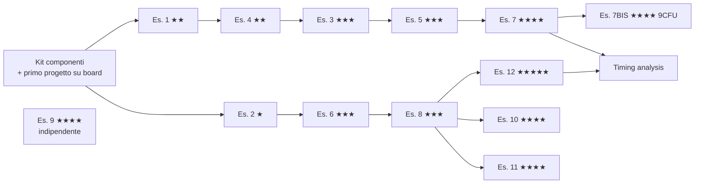

# Piano di preparazione — Elaborato ASDI

Piano di lavoro per l'elaborato di **Architettura dei Sistemi Digitali** (Federico II, prof.ssa De Benedictis), costruito sulle tracce in [elaborato/traccia/](elaborato/traccia/).

Per ogni esercizio trovi:

- **Difficoltà** in stelline e motivazione;
- **Commento**: di cosa parla davvero l'esercizio e dove sta la parte difficile;
- **Traccia spiegata**: ingressi, uscite e comportamento scritti senza ambiguità. Dove la traccia lascia scelte aperte, trovi le **decisioni da prendere**, con una proposta. Qualunque scelta tu faccia, va **scritta e motivata nell'elaborato**;
- **Consegne**: cosa deve esserci nell'elaborato per quell'esercizio;
- **Checklist teorica**: gli argomenti da padroneggiare prima di iniziare;
- **Trappole**: gli errori tipici.

Per usare la scheda (vincoli, pulsanti, display, Vivado) il riferimento è [NEXYS_A7.md](NEXYS_A7.md).

---

## Indice

- [Legenda](#legenda)
- [Quadro generale](#quadro-generale)
- [Requisiti trasversali dell'elaborato](#requisiti-trasversali-dellelaborato)
- [Kit di componenti riusabili](#kit-di-componenti-riusabili)
- [Ordine consigliato](#ordine-consigliato)
- [Capitolo 1 — Reti combinatorie elementari](#capitolo-1--reti-combinatorie-elementari)
  - [Esercizio 1 — Multiplexer 16:1 e rete di interconnessione](#esercizio-1--multiplexer-161-e-rete-di-interconnessione)
  - [Esercizio 2 — Sistema ROM + M](#esercizio-2--sistema-rom--m)
- [Capitolo 2 — Reti sequenziali elementari](#capitolo-2--reti-sequenziali-elementari)
  - [Esercizio 3 — Riconoscitore di sequenze](#esercizio-3--riconoscitore-della-sequenza-101)
  - [Esercizio 4 — Shift register](#esercizio-4--shift-register)
  - [Esercizio 5 — Cronometro](#esercizio-5--cronometro)
  - [Esercizio 6 — Lettura-elaborazione-scrittura (PO/PC)](#esercizio-6--sistema-lettura-elaborazione-scrittura-popc)
- [Capitolo 3 — Macchine aritmetiche](#capitolo-3--macchine-aritmetiche)
  - [Esercizio 7 — Moltiplicatore di Booth](#esercizio-7--moltiplicatore-di-booth)
  - [Esercizio 7BIS — Divisore non-restoring](#esercizio-7bis--divisore-non-restoring-solo-9-cfu)
- [Capitolo 4 — Comunicazione con handshaking](#capitolo-4--comunicazione-con-handshaking)
  - [Esercizio 8 — Due nodi con handshaking](#esercizio-8--due-nodi-con-handshaking)
- [Capitolo 5 — Processore](#capitolo-5--processore)
  - [Esercizio 9 — Processore IJVM](#esercizio-9--processore-ijvm)
- [Capitolo 6 — Interfaccia seriale](#capitolo-6--interfaccia-seriale)
  - [Esercizio 10 — Comunicazione UART fra due unità](#esercizio-10--comunicazione-uart-fra-due-unità)
- [Capitolo 7 — Switch multistadio](#capitolo-7--switch-multistadio)
  - [Esercizio 11 — Omega network](#esercizio-11--switch-multistadio-omega-network)
- [Capitolo 8 — Prova d'esame dicembre 2024](#capitolo-8--prova-desame-dicembre-2024)
  - [Esercizio 12 — Nodi A/B con ROM, handshaking e CLA](#esercizio-12--nodi-ab-con-rom-handshaking-e-sommatore-cla)
- [Materiale extra: il paper PRESENT](#materiale-extra-il-paper-present)
- [Timing analysis (obbligatoria)](#timing-analysis-obbligatoria)
- [Checklist teorica generale](#checklist-teorica-generale)
- [Tracker di avanzamento](#tracker-di-avanzamento)

---

## Legenda

**Difficoltà**

| Stelle | Significato |
|---|---|
| ★☆☆☆☆ | Riscaldamento: poche ore, nessuna insidia concettuale |
| ★★☆☆☆ | Semplice, ma richiede cura (strutturale, I/O su scheda) |
| ★★★☆☆ | Medio: macchina a stati o sistema con parte operativa e parte di controllo |
| ★★★★☆ | Impegnativo: algoritmo non banale, più macchine che interagiscono, codice esistente da capire |
| ★★★★★ | Il più difficile: più sottosistemi, clock diversi, livello d'esame |

**Tag**

- 🅱 = richiede implementazione **su board** (Nexys A7)
- 9️⃣ = parte richiesta **solo agli studenti da 9 CFU**
- ⏱ = stima indicativa delle ore di lavoro (progetto + VHDL + simulazione + board + scrittura)

---

## Quadro generale

| Es. | Argomento | Difficoltà | Board | Parti 9 CFU | ⏱ |
|---|---|---|---|---|---|
| 1 | Mux 16:1 per composizione + rete 16→4 + acquisizione dati a due metà | ★★☆☆☆ | 🅱 (1.3) | — | 8 h |
| 2 | ROM 16×8 combinatoria + macchina M 8→4 | ★☆☆☆☆ | 🅱 (2.2) | — | 4 h |
| 3 | Riconoscitore della sequenza 101 con due modi | ★★★☆☆ | 🅱 (3.2) | — | 10 h |
| 4 | Shift register N bit, destra/sinistra, 1 o 2 posizioni, comportamentale + strutturale | ★★☆☆☆ | — | — | 6 h |
| 5 | Cronometro hh:mm:ss con set/reset (+ intertempi) | ★★★☆☆ (5.3: ★★★★☆) | 🅱 (5.2) | 5.3 | 12 h (+6 h) |
| 6 | ROM → M → MEM con parte operativa e unità di controllo | ★★★☆☆ | 🅱 (6.2) | — | 10 h |
| 7 | Moltiplicatore di Booth 8×8 | ★★★★☆ | 🅱 (7.2) | — | 14 h |
| 7BIS | Divisore non-restoring 4 bit | ★★★★☆ | 🅱 | **tutto** | 10 h |
| 8 | Due nodi A/B con handshaking e somma | ★★★☆☆ | — | — | 10 h |
| 9 | Processore IJVM: analisi di due istruzioni + modifica di un opcode | ★★★★☆ | — | — | 12 h |
| 10 | Due unità che comunicano via UART (RS232RefComp) | ★★★★☆ | 🅱 (10bis) | 10bis | 12 h (+6 h) |
| 11 | Switch multistadio Omega a 4 nodi con priorità fissa | ★★★★☆ (11.2: ★★★★★) | — | 11.2, 11.3 | 12 h (+10 h) |
| 12 | Prova d'esame: ROM + handshaking + CLA + clock diversi | ★★★★★ | — | — | 14 h |
| — | Timing analysis di almeno un sistema | ★★☆☆☆ | — | — | 3 h |

> **6 o 9 CFU?** Le parti 9️⃣ servono solo se il tuo esame è da 9 CFU. Verificalo prima di pianificare: sono circa 30 ore di lavoro in più.

---

## Requisiti trasversali dell'elaborato

Dal template `Elaborato ASDI.docx`, **ogni esercizio** nel documento deve avere queste sezioni:

1. **Progetto e architettura**: l'approccio di progetto, il **disegno architetturale** (schema a blocchi del sistema e dei componenti) e la descrizione delle funzionalità.
2. **Implementazione**: il codice VHDL dei componenti **significativi**. I componenti elementari riusati in più esercizi (full adder, contatori, registri, debouncer, …) vanno in **appendice**, non ripetuti.
3. **Simulazione**: i testbench più rilevanti e la **discussione** dei risultati (forme d'onda commentate, non solo screenshot).
4. **Sintesi su board** (se richiesta): l'architettura aggiuntiva per l'I/O (debouncer, driver del display, reti di acquisizione) e il **file di constraint** usato.
5. **Timing analysis** (se richiesta): vedi [Timing analysis](#timing-analysis-obbligatoria).

E dalla `NOTA finale`: **per considerare completo l'elaborato va fatta la timing analysis di almeno uno dei sistemi realizzati.**

Regole pratiche che ne derivano:

- [ ] Per ogni esercizio, disegna **prima** lo schema a blocchi (carta, draw.io o TikZ), **poi** scrivi il VHDL.
- [ ] Ogni componente ha il suo testbench, possibilmente **auto-verificante** (con `assert`).
- [ ] Tieni un file `.xdc` per ogni progetto su board e riportalo nell'elaborato.
- [ ] Annota **subito** le decisioni di progetto (le trovi elencate esercizio per esercizio): alla fine è difficile ricostruire perché avevi scelto qualcosa.

---

## Kit di componenti riusabili

Molti esercizi usano gli stessi mattoni. Costruiscili e testali **una volta sola** all'inizio: finiscono in appendice e fanno risparmiare molto tempo.

| Componente | Serve in | Note |
|---|---|---|
| `mux4` (mux 4:1) | 1 | |
| `full_adder`, `rca` | 7, 8, 12 | base per sommatori e confronti |
| `reg_n` (registro N bit con enable e reset) | 1, 3, 4, 6, 7, 8, 12 | generic N |
| `counter_mod_n` (contatore modulo N con enable, load, reset, uscita di fine conteggio) | 5, 6, 7, 8, 10, 12 | generic N |
| `rom` (combinatoria / a lettura sincrona) | 2, 6, 8, 10, 12 | contenuto in una costante `array` |
| `ram` / `mem` (scrittura sincrona) | 6, 8, 10 | |
| `tick_gen` (impulso di enable ogni N cicli) | 3, 5, 6 su board | vedi [NEXYS_A7.md §8.5](NEXYS_A7.md#85-contatore-modulo-16) |
| `debouncer` (sincronizzatore + antirimbalzo + fronte) | tutti gli esercizi su board | vedi [NEXYS_A7.md §8.5](NEXYS_A7.md#85-contatore-modulo-16) |
| `hex7seg` + `seg7_driver` (display a 8 cifre) | 5, 7, 7BIS, 10bis | vedi [NEXYS_A7.md §8.3](NEXYS_A7.md#83-driver-per-il-display-a-7-segmenti-riusabile) |
| `bin2bcd` (binario → decimale, *double dabble*) | 5 (opzionale), 7 | solo se vuoi mostrare numeri in decimale |

---

## Ordine consigliato

L'ordine segue le dipendenze (componenti riusati) e la difficoltà crescente, non la numerazione.



| Fase | Contenuto | Obiettivo |
|---|---|---|
| **0 — Setup** | Vivado, primo progetto su board (es. mux 4:1 di [NEXYS_A7.md §8.1](NEXYS_A7.md#81-multiplexer-41-lab01_mux--puramente-combinatorio)), kit di componenti | saper andare dal VHDL alla scheda senza intoppi |
| **1 — Combinatorio** | Es. 2, Es. 1 | composizione strutturale, generic, ROM |
| **2 — Sequenziale** | Es. 4, Es. 3, Es. 5 | FSM, registri, contatori in cascata, I/O su board |
| **3 — PO/PC** | Es. 6, Es. 8 | separazione parte operativa / controllo, handshaking |
| **4 — Aritmetica** | Es. 7 (+7BIS) | algoritmi aritmetici sequenziali |
| **5 — Sistemi** | Es. 12, Es. 10, Es. 11 | più nodi, protocolli, clock diversi |
| **6 — Processore** | Es. 9 | può essere fatto in qualsiasi momento: è indipendente dagli altri |
| **7 — Chiusura** | timing analysis, revisione dell'elaborato, prove su board finali | |

---

## Capitolo 1 — Reti combinatorie elementari

### Esercizio 1 — Multiplexer 16:1 e rete di interconnessione

**Difficoltà: ★★☆☆☆** — la parte combinatoria è semplice; la "rete di controllo" per acquisire i dati su board (1.3) introduce registri e pulsanti.
🅱 1.3 · ⏱ 8 h

#### Commento

È l'esercizio sulla **progettazione per composizione**: si costruisce un componente grande (mux 16:1) mettendo insieme componenti piccoli (mux 4:1), e poi lo si **riusa** per costruire un sistema (la rete di interconnessione). Il punto 1.3 è il primo contatto con un problema tipico della scheda: **ho meno switch che bit da inserire**, quindi serve una piccola logica sequenziale per caricare i dati in più passi.

#### Traccia spiegata

**1.1 — Mux 16:1 per composizione**

- Ingressi: `d(15 downto 0)` (16 dati da 1 bit), `s(3 downto 0)` (selezione).
- Uscita: `y` (1 bit), con `y = d(s)`.
- Vincolo: **deve** essere costruito con istanze di mux 4:1 (approccio strutturale), non con una `with … select` a 16 casi.
- Struttura attesa: **5 mux 4:1 su due livelli**. Il primo livello ha 4 mux che usano `s(1 downto 0)` e scelgono un dato in ogni gruppo di 4; il secondo livello ha 1 mux che usa `s(3 downto 2)` e sceglie tra i 4 risultati.

```
 d(3..0)   ─► mux4 ─┐
 d(7..4)   ─► mux4 ─┤ s(1..0) al primo livello
 d(11..8)  ─► mux4 ─┼─► mux4 ─► y
 d(15..12) ─► mux4 ─┘    s(3..2) al secondo livello
```

**1.2 — Rete di interconnessione 16 sorgenti → 4 destinazioni**

- Ingressi: `d(15 downto 0)` (le 16 sorgenti, 1 bit ciascuna), `src(3 downto 0)` (quale sorgente), `dst(1 downto 0)` (quale destinazione).
- Uscite: `o(3 downto 0)` (le 4 destinazioni, 1 bit ciascuna).
- Comportamento: la sorgente `d(src)` viene portata sulla destinazione `o(dst)`. **Le altre 3 destinazioni valgono 0.**
- Struttura: **mux 16:1** (dell'1.1) che sceglie la sorgente, seguito da un **demux 1:4** (o decoder 2→4 in AND con il dato) che la instrada verso la destinazione.

```
 d(15..0) ─► MUX 16:1 ──► DEMUX 1:4 ──► o(3..0)
               ▲             ▲
            src(3..0)     dst(1..0)
```

**1.3 — Su board, con acquisizione a due metà**

- I **16 bit di dato** non si leggono direttamente dagli switch: si inseriscono **8 alla volta**. Si impostano 8 switch e si preme il **pulsante 1** per memorizzarli come metà bassa `d(7..0)`; poi si reimpostano gli stessi 8 switch e si preme il **pulsante 2** per memorizzarli come metà alta `d(15..8)`.
- Serve quindi una **"rete di controllo"**: un registro da 16 bit (o due da 8) i cui enable sono comandati dai due pulsanti (dopo debouncing e rilevazione del fronte).
- Gli **ingressi di selezione** (`src` e `dst`, 6 bit) vengono da **altri switch**, letti direttamente.
- Le **4 uscite** vanno su 4 LED.

Assegnazione degli switch proposta (8 + 6 = 14 switch su 16):

| Switch | Funzione |
|---|---|
| SW7..SW0 | metà del dato da caricare |
| SW11..SW8 | `src` (sorgente) |
| SW13..SW12 | `dst` (destinazione) |
| BTNL / BTNR | carica metà bassa / metà alta |
| LED3..LED0 | uscite `o(3..0)` |
| LED15..LED8 (opzionale) | ultima metà caricata, per verifica |

> Attenzione: SW8 e SW9 sono sul banco a 1.8 V (`LVCMOS18` nell'XDC). Vedi [NEXYS_A7.md §3.2](NEXYS_A7.md#32-io-semplici-quelli-che-userai-di-più).

**Decisioni da prendere e documentare**

- [ ] Destinazioni non selezionate a `0` (proposta) oppure con valore mantenuto (servirebbero registri).
- [ ] Pulsanti usati come **enable sincroni** (proposta: `debouncer` + fronte, registro sincrono al clock di sistema) e non come clock.
- [ ] Mostrare o no il dato caricato sui LED rimanenti (utile per il debug e per la demo).

#### Consegne

- [ ] `mux4`, `mux16` strutturale, testbench esaustivo del mux16 (tutte le 16 selezioni con pattern diversi).
- [ ] `demux1_4` (o decoder), `interconnect_16x4` strutturale, testbench.
- [ ] Top per la board con la rete di acquisizione, XDC, prova su scheda.
- [ ] Schema a blocchi di tutti e tre i livelli.

#### Checklist teorica

- [ ] Multiplexer: funzione, tabella di verità, espressione SOP, realizzazione a porte.
- [ ] Composizione di mux: perché 16:1 = 5 × (4:1), come si dividono i bit di selezione tra i livelli.
- [ ] Demultiplexer e decoder: differenza e relazione (demux = decoder con enable).
- [ ] Rete di interconnessione: concetto di sorgente, destinazione, indirizzamento.
- [ ] VHDL: `entity`/`architecture`, istanziazione di componenti (`component` + `port map` oppure `entity work.x`), `with…select`, `when…else`, `std_logic_vector` e slicing.
- [ ] Stili di descrizione: comportamentale, dataflow, **strutturale**.
- [ ] Registri con enable; perché **non** usare un pulsante come clock.
- [ ] Rimbalzi dei pulsanti, debouncing, sincronizzazione degli ingressi asincroni.
- [ ] File XDC: pin, `IOSTANDARD`.

#### Trappole

- Invertire l'ordine dei bit di selezione tra i due livelli (il primo livello deve usare i bit **meno** significativi).
- Nel 1.3, usare direttamente il segnale del pulsante come enable: il registro si carica per milioni di cicli e i rimbalzi non creano problemi solo per caso. Usa l'impulso di fronte del debouncer.

---

### Esercizio 2 — Sistema ROM + M

**Difficoltà: ★☆☆☆☆** — puramente combinatorio; l'unica scelta vera è la funzione M.
🅱 2.2 · ⏱ 4 h

#### Commento

Introduce la **ROM come rete combinatoria** (una tabella indirizzata) e la composizione di due blocchi in serie. È anche la base degli esercizi 6, 8, 10 e 12, dove la ROM diventa sincrona e viene scandita da un contatore.

#### Traccia spiegata

- Sistema **S** con ingresso `A(3 downto 0)` (indirizzo) e uscita `Y(3 downto 0)`.
- **ROM**: 16 locazioni × 8 bit, **puramente combinatoria** (l'uscita cambia appena cambia l'indirizzo, niente clock). Il contenuto lo decidi tu.
- **M**: rete combinatoria con ingresso a 8 bit e uscita a 4 bit; la funzione è **a tua scelta**.
- `Y = M(ROM[A])`.

```
 A(3..0) ─► ROM 16×8 ─(8 bit)─► M ─► Y(3..0)
```

**Decisioni da prendere e documentare**

- [ ] **Contenuto della ROM**: sceglilo in modo che i test siano significativi (valori diversi, casi limite come `0x00` e `0xFF`).
- [ ] **Funzione M** (8 → 4 bit). Proposte, dalla più semplice alla più interessante:
  - somma dei due nibble modulo 16: `Y = ROM[A](7..4) + ROM[A](3..0)`;
  - XOR dei due nibble: `Y = ROM[A](7..4) xor ROM[A](3..0)`;
  - **conteggio degli uni** (*popcount*): 0…8, sta in 4 bit. È una buona scelta: è non banale e facile da verificare.
- [ ] Come è realizzata M: comportamentale o strutturale. Per la funzione di conteggio degli uni, una versione strutturale con full adder è un buon esercizio.

**2.2 su board:** 4 switch per l'indirizzo, 4 LED per `Y`. Proposta: mostra anche il byte grezzo letto dalla ROM su altri 8 LED, così si vede sia l'ingresso sia l'uscita di M.

#### Consegne

- [ ] `rom16x8` (con `type rom_t is array (0 to 15) of std_logic_vector(7 downto 0)` e una `constant`), `machine_m`, `system_s`.
- [ ] Testbench esaustivo sui 16 indirizzi con `assert` sul valore atteso.
- [ ] Top, XDC, prova su scheda.

#### Checklist teorica

- [ ] ROM come rete combinatoria: decoder degli indirizzi + matrice OR.
- [ ] VHDL: tipi `array`, `constant`, conversione indirizzo → indice (`to_integer(unsigned(A))`), `numeric_std`.
- [ ] Differenza tra ROM combinatoria e ROM a lettura sincrona (serve dall'Es. 6 in poi).
- [ ] Come Vivado implementa una piccola ROM (LUT, *distributed ROM*) e quando usa invece la Block RAM.

#### Trappole

- Usare `std_logic_arith`/`std_logic_unsigned` insieme a `numeric_std`: scegli **solo** `numeric_std`.

---

## Capitolo 2 — Reti sequenziali elementari

### Esercizio 3 — Riconoscitore della sequenza 101

**Difficoltà: ★★★☆☆** — la FSM è piccola, ma i due modi vanno capiti **esattamente** e la versione su board richiede di ragionare sulla tempificazione.
🅱 3.2 · ⏱ 10 h

#### Commento

È l'esercizio classico sulle **macchine a stati finiti**. L'insidia sta nella semantica dei due modi: vanno interpretati con precisione e verificati con sequenze di prova scelte bene. La parte su board insegna a separare il **segnale di tempificazione** (quando la macchina "guarda" il bit) dall'**acquisizione** degli ingressi (quando l'utente li fornisce).

#### Traccia spiegata

- Ingressi: `i` (bit di dato seriale), `A` (tempificazione: a ogni evento di A la macchina consuma **un** bit), `M` (modo).
- Uscita: `Y` = 1 quando la sequenza `101` è stata riconosciuta.
- **M = 0: gruppi di 3 non sovrapposti.** I bit sono divisi in blocchi consecutivi (1°-2°-3°, 4°-5°-6°, …). Al **terzo bit di ogni blocco** la macchina dice se il blocco è `101`. Una sequenza a cavallo di due blocchi **non** viene riconosciuta.
- **M = 1: bit per bit, con ritorno allo stato iniziale.** La macchina cerca `101` su una finestra scorrevole: la sequenza può iniziare in **qualsiasi** posizione. Quando la riconosce **torna allo stato iniziale**: i bit della sequenza appena trovata **non** vengono riusati per la successiva.

Esempio chiarificatore, con ingresso `1 1 0 1 0 1 0 1` (posizioni 1…8):

| Posizione | 1 | 2 | 3 | 4 | 5 | 6 | 7 | 8 |
|---|---|---|---|---|---|---|---|---|
| `i` | 1 | 1 | 0 | 1 | 0 | 1 | 0 | 1 |
| **M = 0** (blocchi 1-3, 4-6; il blocco 7-8 è incompleto) | | | 0 (`110`) | | | **1** (`101`) | | |
| **M = 1** (ritorno allo stato iniziale) | 0 | 0 | 0 | **1** | 0 | 0 | 0 | **1** |
| *per confronto:* sovrapposizione totale (**non** richiesta) | 0 | 0 | 0 | 1 | 0 | 1 | 0 | 1 |

Con M = 1, alla posizione 4 si riconosce `101` (posizioni 2-4) e si torna all'inizio. Il `0` in posizione 5 e l'`1` in posizione 6 ripartono da zero: `01` non basta, quindi in posizione 6 non si riconosce nulla. Con sovrapposizione totale invece l'`1` in posizione 4 sarebbe riusato come inizio della sequenza successiva.

**Automi di riferimento** (stati di Moore in base a "quanto della sequenza ho visto"):

- M = 1: `S0` (niente) –1→ `S1` (visto 1) –0→ `S2` (visto 10) –1→ **riconosciuto**, poi `S0`. Da `S1` con 1 si resta in `S1`; da `S2` con 0 si torna a `S0`.
- M = 0: serve anche **contare la posizione nel blocco** (1°, 2°, 3° bit) e ricordare se il blocco finora è compatibile con `101`. Dopo il terzo bit si torna sempre all'inizio del blocco, qualunque sia l'esito.

**3.2 su board**

- `S1` = switch per `i`, `S2` = switch per `M`.
- `B1` acquisisce il valore di `S1`, `B2` acquisisce il valore di `S2`, "in sincronismo con A".
- `A` deve essere **ottenuto dal clock della scheda**: un segnale periodico lento (es. un impulso `tick` a 1–2 Hz), non un pulsante.
- `Y` su un LED.

Interpretazione proposta per l'acquisizione (va scritta nell'elaborato): premendo `B1` il valore di `S1` viene memorizzato in un registro e si segnala "nuovo bit disponibile". Al successivo evento di `A` la macchina consuma quel bit, **una sola volta**. Senza questo meccanismo, con `A` periodico la macchina rileggerebbe lo stesso bit a ogni tick. `B2` aggiorna il modo, che viene applicato al successivo evento di `A`.

**Decisioni da prendere e documentare**

- [ ] **Mealy o Moore.** Con Moore `Y` dura un intero periodo di A ed è più facile da vedere su un LED; con Mealy si ha un ciclo di anticipo ma l'uscita dipende dall'ingresso corrente.
- [ ] **Cosa succede al cambio di modo:** proposta, reset della FSM allo stato iniziale.
- [ ] Come "A" pilota la macchina: proposta, **clock di sistema + enable = A** (A è un impulso lungo un ciclo), non A come vero clock.
- [ ] Per quanto resta acceso il LED `Y`: con Moore fino al bit successivo, oppure prolungato apposta.

#### Consegne

- [ ] Diagrammi degli stati (entrambi i modi, o un'unica FSM con M come ingresso), con tabella di transizione.
- [ ] VHDL della FSM (stile a 2 o 3 process), testbench con la sequenza d'esempio sopra **e** casi limite (`101101`, `10101`, `111`, cambio di modo a metà).
- [ ] Top con `tick_gen` (A), `debouncer` per B1 e B2, registri di acquisizione, XDC, prova su board.

#### Checklist teorica

- [ ] Macchine a stati finiti: definizione formale, **Mealy vs Moore**, vantaggi e svantaggi.
- [ ] Diagramma degli stati, tabella di transizione, codifica degli stati (binaria, one-hot, Gray).
- [ ] Minimizzazione degli stati (stati equivalenti).
- [ ] Riconoscitori di sequenza con e senza sovrapposizione.
- [ ] VHDL per FSM: tipo enumerato per gli stati, process di stato (sequenziale) e process di uscita/prossimo stato (combinatorio), `case`.
- [ ] Clock, enable e segnale di tempificazione: perché A diventa un enable e non un clock.
- [ ] Sincronizzazione e debouncing dei pulsanti; generazione di un tick lento da 100 MHz.

#### Trappole

- Process combinatorio con `case` incompleto → **latch**.
- Nel testbench, cambiare `i` esattamente sul fronte attivo: meglio cambiarlo a metà periodo.
- Su board, vedere `Y` accendersi per 10 ns (invisibile): l'uscita deve durare abbastanza da essere vista.

---

### Esercizio 4 — Shift register

**Difficoltà: ★★☆☆☆** — la versione comportamentale è immediata; quella **strutturale** richiede di progettare il singolo stadio e gestire i bordi.
Nessuna board richiesta · ⏱ 6 h

#### Commento

L'esercizio serve a confrontare **due stili di descrizione dello stesso hardware** e a usare bene i `generic` e il costrutto `generate`. La difficoltà vera è la versione strutturale: ogni bit è un flip-flop preceduto da un mux che sceglie da dove prendere il nuovo valore, e i bit ai bordi hanno vicini "mancanti".

#### Traccia spiegata

- Registro di **N bit**, con N **generic**.
- Operazioni: shift a **destra** o a **sinistra**, di **1 o 2 posizioni**. Direzione e ampiezza sono scelte dall'esterno con **segnali di selezione**.
- Due realizzazioni: **a) comportamentale** e **b) strutturale**.

La traccia non dice come si carica il valore iniziale né cosa entra dai bordi: sono decisioni da prendere. Interfaccia proposta:

| Porta | Direzione | Significato |
|---|---|---|
| `clk`, `rst` | in | clock e reset |
| `load` | in | `1` = carica `din` in parallelo (ha priorità sullo shift) |
| `din(N-1..0)` | in | dato da caricare |
| `en` | in | `1` = esegui lo shift in questo ciclo |
| `dir` | in | `0` = destra, `1` = sinistra |
| `amt` | in | `0` = 1 posizione, `1` = 2 posizioni |
| `sin(1..0)` | in | bit che entrano dal bordo (per lo shift di 2 servono 2 bit) |
| `q(N-1..0)` | out | contenuto del registro |

Esempio con N = 8, `q = 1011_0110`, `sin = "00"`:

| `dir` | `amt` | risultato |
|---|---|---|
| destra | 1 | `0101_1011` |
| destra | 2 | `0010_1101` |
| sinistra | 1 | `0110_1100` |
| sinistra | 2 | `1101_1000` |

**Versione strutturale:** ogni bit `k` è un **flip-flop D** preceduto da un **mux** che sceglie tra: mantieni (`q(k)`), carica (`din(k)`), `q(k+1)` (destra di 1), `q(k+2)` (destra di 2), `q(k-1)` (sinistra di 1), `q(k-2)` (sinistra di 2). Si replica con `for … generate`; per i bit vicini ai bordi (k = 0, 1, N-2, N-1) i vicini mancanti diventano i bit di `sin`.

**Decisioni da prendere e documentare**

- [ ] Riempimento dei bordi: zeri, ingresso seriale `sin` (proposta), oppure rotazione.
- [ ] Shift logico o aritmetico (a destra, un shift aritmetico replica il bit di segno).
- [ ] Presenza di caricamento parallelo (proposta: sì, altrimenti il registro non si può inizializzare).
- [ ] Codifica della selezione: `dir` + `amt` separati (proposta) oppure un unico `sel(1..0)`.

#### Consegne

- [ ] Architettura comportamentale e strutturale **della stessa entity** (due `architecture`), oppure due entity con la stessa interfaccia.
- [ ] Un unico testbench che istanzia **entrambe** e verifica che diano lo stesso risultato (confronto automatico).
- [ ] Prove con almeno due valori di N (es. 4 e 8) e N minimo sensato (con N = 2 lo shift di 2 svuota il registro).
- [ ] Opzionale: confronto delle risorse usate dopo la sintesi.

#### Checklist teorica

- [ ] Registri a scorrimento: SISO, SIPO, PISO, PIPO; shift logico, aritmetico, rotazione.
- [ ] Flip-flop D, registro con enable, mux di ingresso.
- [ ] VHDL: `generic`, `for … generate`, `if … generate`, operatori di concatenazione `&`, `shift_left`/`shift_right` di `numeric_std`.
- [ ] Stile comportamentale vs strutturale: cosa cambia nel codice, cosa (non) cambia nell'hardware sintetizzato.
- [ ] Più `architecture` per la stessa `entity` e la `configuration` (o la selezione esplicita `entity work.x(arch)`).

#### Trappole

- Indici fuori range ai bordi nella versione strutturale (errore in elaborazione oppure, peggio, valori `U` in simulazione).
- Dimenticare la priorità tra `load`, `en` e `rst`.

---

### Esercizio 5 — Cronometro

**Difficoltà: ★★★☆☆** (5.1–5.2) · **★★★★☆** (5.3)
🅱 5.2 · 9️⃣ 5.3 · ⏱ 12 h (+6 h per il 5.3)

#### Commento

È l'esercizio sui **contatori in cascata** e sulla **base dei tempi**. La logica è semplice, ma ci sono tre aspetti che richiedono attenzione: il collegamento tra i contatori (chi abilita chi), il caricamento del valore iniziale e l'interfaccia utente su board con pochi switch per molti bit.

#### Traccia spiegata

- Il cronometro conta **secondi, minuti e ore** partendo da una base dei tempi (il clock della scheda, 100 MHz, da cui si ricava un impulso a **1 Hz**).
- **Set:** carica un valore iniziale (ore, minuti, secondi) fornito in ingresso.
- **Reset:** azzera il tempo.
- **Vincolo:** approccio **strutturale**, cioè contatori collegati tra loro. Lo schema è a scelta.

Schema di riferimento (contatori **sincroni** con enable in cascata, tutti sullo stesso clock):

```
 tick 1 Hz ─► [sec mod 60] ─tc─► [min mod 60] ─tc─► [ore mod 24]
```

Ogni contatore avanza quando il suo `enable` vale 1; il contatore successivo è abilitato da `enable AND fine_conteggio` del precedente. Si può anche spezzare ogni campo in due contatori **BCD** (unità mod 10 + decine mod 6), che rende immediata la visualizzazione in decimale.

**5.2 su board**

- Display a 7 segmenti per l'orario. La Nexys A7 ha **8 cifre**, quindi `hh.mm.ss` (6 cifre) ci sta senza bisogno dei LED.
- **Switch** per l'orario iniziale, un **pulsante di set**, un **pulsante di reset**.
- Codifica sui display: esadecimale o decimale, a scelta. Decimale (BCD) è molto più leggibile ed è la scelta proposta.

Problema degli switch: in binario servono 5 bit (ore) + 6 (minuti) + 6 (secondi) = **17 bit, ma gli switch sono 16**. Soluzione proposta: 2 switch selezionano il campo (ore/minuti/secondi) e 6 switch danno il valore; il pulsante di set carica **solo quel campo**. In alternativa si possono usare 3 pulsanti di set, uno per campo.

**5.3 (9 CFU) — Intertempi**

- Ingresso di **stop** (in pratica un pulsante "giro"): a ogni pressione il tempo corrente viene **memorizzato** in una memoria interna di N intertempi. **Il cronometro non si ferma**: un intertempo è una fotografia del tempo in quel momento.
- Opzionale: una **modalità di visualizzazione** in cui ogni pressione di un pulsante mostra l'intertempo successivo sul display.

**Decisioni da prendere e documentare**

- [ ] Contatori binari (mod 60/60/24) o BCD (mod 10/6 in coppia). Proposta: BCD, per il display.
- [ ] Dopo 23:59:59 si torna a 00:00:00 (proposta) oppure le ore contano oltre 24.
- [ ] Priorità: reset > set > conteggio.
- [ ] Valori non validi agli switch (es. minuti = 75): saturare, ignorare o accettare. Va detto.
- [ ] 5.3: cosa succede quando la memoria degli intertempi è piena (sovrascrittura circolare o blocco).

#### Consegne

- [ ] `counter_mod_n` generico con enable, load, reset e uscita di fine conteggio (in appendice).
- [ ] `chrono` strutturale, testbench con **base dei tempi accelerata** (generic: un tick ogni pochi cicli, altrimenti un'ora simulata richiederebbe 3,6·10¹¹ cicli).
- [ ] Test dei passaggi critici: 00:00:59 → 00:01:00, 00:59:59 → 01:00:00, 23:59:59 → 00:00:00, set e reset durante il conteggio.
- [ ] Top con `tick_gen`, debouncer, driver del display, XDC, prova su scheda.
- [ ] 9️⃣ Memoria degli intertempi, logica di scrittura e lettura, test.

#### Checklist teorica

- [ ] Contatori sincroni e asincroni; contatori modulo N; contatori con caricamento parallelo.
- [ ] Contatori in cascata: segnale di **terminal count** e catena degli enable.
- [ ] Codifica BCD, visualizzazione su 7 segmenti, multiplexing del display.
- [ ] Base dei tempi: divisione di frequenza tramite impulsi di enable (non clock derivati).
- [ ] Reset sincrono vs asincrono.
- [ ] 9️⃣ Memorie (register file / RAM) con scrittura sincrona, puntatore di scrittura e di lettura.

#### Trappole

- Generare il clock a 1 Hz con un flip-flop e usarlo come clock per i contatori: vedi [NEXYS_A7.md §7.3](NEXYS_A7.md#73-un-solo-clock-e-usa-i-clock-enable).
- Abilitare i minuti con il solo `tc` dei secondi senza metterlo in AND con il tick: i minuti avanzerebbero per un secondo intero (100 milioni di volte).

---

### Esercizio 6 — Sistema lettura-elaborazione-scrittura (PO/PC)

**Difficoltà: ★★★☆☆** — primo sistema con **parte operativa + parte di controllo** e memorie sincrone: bisogna ragionare ciclo per ciclo.
🅱 6.2 · ⏱ 10 h

#### Commento

Il titolo "PO_PC" dice tutto: è l'esercizio sulla scomposizione di un sistema in **Parte Operativa** (ROM, M, MEM, contatore degli indirizzi) e **Parte di Controllo** (una FSM che genera i segnali di comando nel momento giusto). La difficoltà sta tutta nella **tempificazione**: la ROM ha lettura sincrona, quindi il dato arriva un ciclo **dopo** l'indirizzo, e la FSM deve tenerne conto.

#### Traccia spiegata

**Parte operativa**

- **ROM**: N locazioni × 8 bit, **lettura sincrona** (l'indirizzo viene campionato sul fronte di clock e il dato è disponibile dopo quel fronte).
- **M**: macchina combinatoria 8 → 4 bit, funzione a scelta (si può riusare quella dell'Es. 2).
- **MEM**: N locazioni × 4 bit, **scrittura sincrona**.
- **Contatore**: fornisce gli indirizzi, lo stesso indirizzo `i` per ROM e MEM.

**Parte di controllo (FSM)**

- Attende `START` (segnale esterno).
- Dopo lo start, per `i = 0 … N-1`: legge `ROM[i]`, calcola `M(ROM[i])`, scrive in `MEM[i]`, incrementa il contatore.
- Quando il contatore ha scandito tutte le N locazioni si ferma (e torna ad attendere START).

```
                ┌──────────── Parte di Controllo (FSM) ─────────────┐
 START ────────►│ IDLE → READ → WRITE → (INC) → … → DONE → IDLE     │
                └──┬──────────┬──────────┬────────────▲─────────────┘
                   │ en_cnt   │ rd_rom   │ wr_mem     │ tc (fine)
 ┌─────────────────▼──────────▼──────────▼────────────┴──────────────┐
 │ contatore ──addr──► ROM ──8 bit──► M ──4 bit──► MEM               │
 │     └────────────────────addr──────────────────────┘              │
 └──────────────────────── Parte Operativa ──────────────────────────┘
```

Tempificazione minima di un giro (una possibile, da scegliere e disegnare):

| Ciclo | Stato | Cosa succede |
|---|---|---|
| t | READ | `rd_rom = 1`: la ROM campiona `addr = i` sul fronte |
| t+1 | WRITE | il dato `ROM[i]` è stabile, M calcola; `wr_mem = 1`: MEM scrive `M(ROM[i])` in `addr = i` sul fronte |
| t+2 | INC | `en_cnt = 1`: `i ← i+1`; se era l'ultimo → DONE, altrimenti → READ |

(Le fasi WRITE e INC si possono fondere se il contatore si incrementa sullo stesso fronte della scrittura: va ragionato con attenzione.)

**6.2 su board**

- Un pulsante per **read** e uno per **reset**; i LED mostrano **le uscite della macchina M istante per istante**.
- Con il clock a 100 MHz tutto il processo dura pochi ns e non si vedrebbe nulla. Interpretazione proposta: il pulsante *read* fa avanzare il sistema **di una locazione per pressione** (modalità passo-passo), e i LED mostrano l'uscita di M (4 bit), più l'indirizzo corrente su altri LED. In alternativa, *read* = START e il sistema avanza lentamente con un `tick_gen`.

**Decisioni da prendere e documentare**

- [ ] Valore di N (proposta: 8 o 16) e contenuto della ROM.
- [ ] Automa: Moore (proposta, più facile da tempificare) o Mealy.
- [ ] Numero di cicli per locazione (2 o 3) e diagramma temporale.
- [ ] Significato di *read* su board (passo-passo o start).
- [ ] Come verificare il contenuto di MEM a fine processo (in simulazione: lettura della memoria nel testbench; su board: modalità di rilettura opzionale).

#### Consegne

- [ ] Schema a blocchi PO/PC con **tutti** i segnali di controllo e di stato nominati.
- [ ] Diagramma degli stati della FSM e **diagramma temporale** (quale segnale è alto in quale ciclo).
- [ ] VHDL strutturale del sistema (PO e PC come componenti separati).
- [ ] Testbench che verifica che a fine processo `MEM[i] = M(ROM[i])` per ogni `i`.
- [ ] Top per board, XDC, prova su scheda.

#### Checklist teorica

- [ ] Modello **Parte Operativa / Parte di Controllo**: segnali di controllo (PC → PO) e di stato/condizione (PO → PC).
- [ ] FSM di controllo, **ASM chart**.
- [ ] Memorie: ROM/RAM, lettura sincrona e asincrona, scrittura sincrona, latenza di lettura.
- [ ] Contatore come generatore di indirizzi, fine conteggio.
- [ ] Diagrammi temporali: cosa succede sul fronte, cosa è stabile tra due fronti.
- [ ] VHDL: inferenza di memorie (`array` + process sincrono), come Vivado le mappa (distributed RAM / BRAM).

#### Trappole

- **Errore di un ciclo:** scrivere in MEM prima che il dato della ROM sia disponibile, o con l'indirizzo già incrementato. In simulazione si vede MEM "sfasata di una posizione".
- Dimenticare l'ultima locazione (fermarsi a N-2) o farne una in più (N).

---

## Capitolo 3 — Macchine aritmetiche

### Esercizio 7 — Moltiplicatore di Booth

**Difficoltà: ★★★★☆** — algoritmo non banale, complemento a 2, parte operativa con shift aritmetico, FSM di controllo e un caso limite insidioso.
🅱 7.2 · ⏱ 14 h

#### Commento

È l'esercizio "di punta" sulle macchine aritmetiche sequenziali. Bisogna conoscere **perfettamente** l'algoritmo di Booth (radix-2), saperlo eseguire a mano e tradurlo in una parte operativa (registri, sommatore/sottrattore, shift) più un'unità di controllo che ripete il passo 8 volte. È anche un ottimo candidato per la **timing analysis**.

#### Traccia spiegata

- Ingressi: `A` e `B`, **8 bit ciascuno**, interi **in complemento a 2** (Booth nasce per i numeri con segno; se il corso li vuole senza segno va detto esplicitamente).
- Uscita: prodotto `P = A × B` su **16 bit** in complemento a 2.
- Segnali di controllo tipici: `start` (inizia), `done` (risultato pronto).

**Algoritmo (radix-2)** con moltiplicando `M = A`, moltiplicatore `Q = B`:

1. `Acc ← 0`, `Q ← B`, `Q₋₁ ← 0`, `count ← 8`.
2. Guarda la coppia `(Q₀, Q₋₁)`:
   - `10` → `Acc ← Acc − M`
   - `01` → `Acc ← Acc + M`
   - `00` / `11` → niente
3. **Shift aritmetico a destra** di `Acc, Q, Q₋₁` come un unico registro (il bit di segno di Acc si replica).
4. `count ← count − 1`; se `count ≠ 0` torna al passo 2.
5. `P = Acc & Q`.

Esempio da saper fare a mano (e da mettere nell'elaborato): `3 × (−2)` su 4 bit.

**Parte operativa:** registri `Acc`, `Q`, `Q₋₁`, `M`, un **sommatore/sottrattore** (sottrazione = somma del complemento a 2: `Acc + not M + 1`), la logica di shift e un **contatore** dei passi.
**Parte di controllo:** FSM `IDLE → INIT → (CHECK → ADD/SUB → SHIFT) × 8 → DONE`.

**7.2 su board** — modalità libera. Proposta: `A` su SW15..8, `B` su SW7..0, BTNC = start, prodotto in **esadecimale** sulle 4 cifre di destra del display e `A`, `B` sulle 4 di sinistra; LED per `done`. Con `bin2bcd` si può mostrare il risultato in decimale con segno.

**Decisioni da prendere e documentare**

- [ ] Numeri con segno (proposta) o senza segno.
- [ ] Larghezza di `Acc`: con 8 bit il caso `M = −128` va in overflow durante `Acc − M`. **Proposta: Acc a 9 bit** (un bit di guardia), oppure dimostrare che il caso è gestito.
- [ ] Un passo per ciclo (ADD e SHIFT nello stesso ciclo) o due cicli per passo: il secondo è più facile da leggere nelle forme d'onda.
- [ ] Sommatore: comportamentale (`+`) o strutturale (RCA dell'appendice, utile per il confronto di timing).

#### Consegne

- [ ] Esempio svolto a mano, schema PO/PC, ASM chart.
- [ ] VHDL e testbench **esaustivo**: tutte le 65 536 coppie, confrontate con `signed(A) * signed(B)` calcolato nel testbench. In XSim sono pochi secondi.
- [ ] Test esplicito dei casi limite: `0`, `1`, `−1`, `127`, `−128 × −128 = 16384`, `−128 × 127`.
- [ ] Top per board, XDC, prova su scheda.
- [ ] Candidato ideale per la timing analysis (vedi [Timing analysis](#timing-analysis-obbligatoria)).

#### Checklist teorica

- [ ] Rappresentazione in **complemento a 2**: range, estensione del segno, overflow.
- [ ] Somma e sottrazione in complemento a 2; sommatore/sottrattore con XOR sul secondo operando e carry-in = 1.
- [ ] Moltiplicazione sequenziale *shift-and-add* senza segno (come riferimento).
- [ ] **Algoritmo di Booth radix-2**: idea (codifica delle sequenze di 1), regole sulla coppia `Q₀Q₋₁`, perché funziona con i numeri negativi.
- [ ] Cenni a Booth radix-4 (modified Booth), come possibile estensione.
- [ ] Shift aritmetico vs logico.
- [ ] Macchina PO/PC con contatore di iterazioni; ASM chart.
- [ ] VHDL: `signed`/`unsigned`, `resize`, `shift_right` su `signed`.

#### Trappole

- Usare lo shift logico al posto di quello aritmetico: con risultati negativi il prodotto è sbagliato.
- Dimenticare di azzerare `Q₋₁` all'inizio.
- Caso `−128`: il risultato di `Acc − M` esce dal range di 8 bit.

---

### Esercizio 7BIS — Divisore non-restoring (solo 9 CFU)

**Difficoltà: ★★★★☆** — 9️⃣ · 🅱 · ⏱ 10 h

#### Commento

Simile in struttura al Booth (registri, sommatore/sottrattore, shift, contatore, FSM), ma con l'algoritmo di divisione **non-restoring**: a ogni passo, invece di "ripristinare" il resto quando diventa negativo, si compensa al passo successivo sommando invece di sottrarre. Serve saperlo eseguire a mano e sapere spiegare la differenza con il *restoring*.

#### Traccia spiegata

- Ingressi: dividendo `A` e divisore `B`, **4 bit ciascuno**.
- Uscite: quoziente `Q` (4 bit) e resto `R` (4 bit), con `A = B·Q + R` e `0 ≤ R < B`.
- "Divisione intera": proposta, operandi **senza segno**.

**Algoritmo** (n = 4; `Acc` a n+1 = 5 bit con segno, `Q ← A`, `M ← B`):

1. `Acc ← 0`.
2. Ripeti n volte:
   - shift a sinistra di `(Acc, Q)` come un unico registro;
   - se `Acc ≥ 0` → `Acc ← Acc − M`, altrimenti → `Acc ← Acc + M`;
   - `Q₀ ← 1` se il nuovo `Acc ≥ 0`, altrimenti `Q₀ ← 0`.
3. **Correzione finale:** se `Acc < 0` → `Acc ← Acc + M`.
4. Quoziente = `Q`, resto = `Acc`.

**Decisioni da prendere e documentare**

- [ ] Senza segno (proposta) o con segno.
- [ ] **Divisione per zero:** va gestita esplicitamente (es. un'uscita `err`, oppure risultato convenzionale documentato).
- [ ] I/O su board: `A` e `B` su switch, start su pulsante, `Q` e `R` su display o LED.

#### Consegne

- [ ] Esempio a mano (es. `11 / 3 = 3` resto `2`), schema PO/PC, ASM chart.
- [ ] Testbench esaustivo (256 coppie, escluso o gestito `B = 0`) confrontato con `/` e `mod`.
- [ ] Top per board, XDC, prova su scheda.

#### Checklist teorica

- [ ] Divisione binaria con carta e penna.
- [ ] Algoritmo **restoring** e algoritmo **non-restoring**: differenze, numero di operazioni, correzione finale del resto.
- [ ] Perché serve il bit in più in `Acc`.
- [ ] Gestione della divisione per zero.

#### Trappole

- Dimenticare la correzione finale del resto.
- `Acc` a soli 4 bit: il segno si perde.

---

## Capitolo 4 — Comunicazione con handshaking

### Esercizio 8 — Due nodi con handshaking

**Difficoltà: ★★★☆☆** — due FSM che si parlano: la difficoltà è far rispettare il protocollo in tutti i casi.
Nessuna board richiesta · ⏱ 10 h

#### Commento

Introduce la comunicazione tra **due sottosistemi indipendenti**, ognuno con la sua parte operativa e la sua unità di controllo. Il protocollo di **handshaking** garantisce che nessun dato vada perso o venga letto due volte, qualunque sia la velocità relativa dei due nodi. È la base degli esercizi 10, 11 e 12: vale la pena farlo bene.

#### Traccia spiegata

- **Nodo A:** memoria con N stringhe `X(0)…X(N-1)` da M bit, un **contatore** che scandisce gli indici, un'unità di controllo che trasmette.
- **Nodo B:** memoria con N stringhe `Y(0)…Y(N-1)` da M bit, un **contatore**, un sommatore (può essere comportamentale), un'unità di controllo che riceve.
- Per ogni `i`: A invia `X(i)` a B con handshaking; B calcola `S(i) = X(i) + Y(i)` e salva `S(i)` nella propria memoria.
- I **contatori** in A e in B sono **obbligatori** come componenti espliciti: servono a scandire le trasmissioni e a **terminare** la comunicazione dopo N stringhe.

**Protocollo proposto: handshaking a 4 fasi** su un bus dati di M bit e due fili `req` (A → B) e `ack` (B → A):

```
 dato  ──<  X(i) valido  >─────────────
 req   ___/‾‾‾‾‾‾‾‾‾‾‾‾‾‾\_____________
 ack   _______/‾‾‾‾‾‾‾‾‾‾‾‾‾‾\_________
          ①    ②         ③    ④
```

1. A mette `X(i)` sul bus e alza `req`.
2. B vede `req = 1`, cattura il dato, calcola e salva `S(i)`, alza `ack`.
3. A vede `ack = 1`, abbassa `req` (e incrementa il suo contatore).
4. B vede `req = 0`, abbassa `ack` (e incrementa il suo contatore). Si riparte con `i + 1`.

**Decisioni da prendere e documentare**

- [ ] Handshaking a **4 fasi** (proposta: più semplice da ragionare) o a 2 fasi (a transizione).
- [ ] Larghezza di `S(i)`: M+1 bit per non perdere il riporto (proposta), oppure M bit con overflow ignorato.
- [ ] Dove salva B: memoria separata `S` (proposta) oppure sovrascrivendo `Y`.
- [ ] Valori di N e M (proposta: N = 8, M = 4 o 8).
- [ ] Segnale di avvio (`start` per A) e di fine (`done` in entrambi i nodi).
- [ ] Stesso clock per A e B (sufficiente qui; il caso a clock diversi è nell'Es. 12).

#### Consegne

- [ ] Schema a blocchi del sistema (A, B, bus, `req`/`ack`) con PO e PC di ciascun nodo.
- [ ] Automi delle due unità di controllo.
- [ ] Diagramma temporale di **una** trasmissione completa.
- [ ] Testbench che verifica tutte le `S(i)` a fine trasmissione.
- [ ] Opzionale ma molto utile: una versione in cui B è **più lento** (es. aspetta qualche ciclo prima di dare `ack`), per dimostrare che il protocollo funziona comunque.

#### Checklist teorica

- [ ] Comunicazione **sincrona vs asincrona** tra sottosistemi.
- [ ] Protocolli di **handshaking a 2 e a 4 fasi**: sequenza degli eventi, pro e contro.
- [ ] Modello PO/PC applicato a più nodi.
- [ ] Contatori come elemento di terminazione (`tc`).
- [ ] Diagrammi temporali di protocollo.
- [ ] Deadlock: come si genera (es. un nodo aspetta un fronte che non arriverà) e come si evita.

#### Trappole

- A incrementa il contatore prima che B abbia davvero ricevuto: il dato cambia sul bus mentre B lo legge.
- B lascia `ack` alto e A interpreta lo stesso `ack` come conferma della trasmissione successiva (è il motivo della fase ④).

---

## Capitolo 5 — Processore

### Esercizio 9 — Processore IJVM

**Difficoltà: ★★★★☆** — non si progetta da zero, ma bisogna capire un'architettura microprogrammata completa scritta da altri.
Nessuna board richiesta · ⏱ 12 h

#### Commento

Si parte da un'**implementazione fornita** (dal corso) del processore che esegue l'**IJVM** (il sottoinsieme della Java Virtual Machine usato nel testo di Tanenbaum, sulla microarchitettura **Mic-1**). Il lavoro è da "archeologo": simulare, seguire le istruzioni microistruzione per microistruzione, capire come si muovono i dati sui bus. Poi si modifica un codice operativo documentando ogni cambiamento.

> Il codice del processore **non** è tra i file di `traccia/`: va recuperato dal materiale del corso.

#### Traccia spiegata

1. **Analisi tramite simulazione:** si eseguono programmi IJVM sul processore e si studia **in dettaglio il funzionamento di due istruzioni a scelta**. "In dettaglio" significa: quali microistruzioni vengono eseguite, quali registri vengono letti e scritti a ogni ciclo, cosa passa su bus B e bus C, cosa fa l'ALU, come si calcola il prossimo indirizzo di microistruzione, e forme d'onda che lo mostrino.
2. **Modifica di un codice operativo a scelta**, documentando **tutte** le modifiche.

La frase "modificare un codice operativo" ammette due letture. Chiarisci con il docente quale è attesa, oppure scegline una e dichiarala:

- **(a) cambiare il valore numerico dell'opcode** di un'istruzione. In Mic-1 l'opcode **è** l'indirizzo della prima microistruzione nel control store, quindi va spostato il microcodice e aggiornato l'assemblatore o il programma di test;
- **(b) cambiare il comportamento** di un'istruzione (es. `IADD` che diventa una somma con saturazione, oppure una nuova istruzione al posto di una esistente), modificando il suo microprogramma.

**Istruzioni consigliate da analizzare:** una **aritmetica** (`IADD` o `ISUB`: stack, TOS, MDR, ALU) e una **di salto** (`IFEQ` o `GOTO`: lettura dell'offset, uso di MBR, salto condizionato con i flag N/Z) oppure una **con accesso a memoria** (`ILOAD`/`ISTORE`: uso di LV e MAR). Due istruzioni di tipo diverso mostrano parti diverse della macchina.

#### Consegne

- [ ] Schema della microarchitettura (datapath, registri, bus, ALU, shifter, control store, MPC, MIR).
- [ ] Per ciascuna delle due istruzioni: microprogramma commentato, tabella ciclo per ciclo, forme d'onda annotate.
- [ ] Descrizione della modifica: file toccati, righe cambiate, motivazione, programma di test prima/dopo.

#### Checklist teorica

- [ ] Architettura a **stack** e la JVM/IJVM: set di istruzioni, formato (opcode + operandi), frame dei metodi, LV, SP, CPP.
- [ ] Microarchitettura **Mic-1**: registri (MAR, MDR, PC, MBR, SP, LV, CPP, TOS, OPC, H), bus B e C, ALU e shifter, flag N e Z.
- [ ] **Controllo microprogrammato**: control store, microistruzione (campi Addr, JAM, ALU, C, Mem, B), MPC, MIR.
- [ ] Ciclo di fetch/decode/execute nel microcodice (`Main1`), dispatch tramite opcode (`MBR` → `MPC`).
- [ ] Accessi a memoria: tempistica di lettura/scrittura (dato disponibile al ciclo successivo).
- [ ] Controllo cablato vs microprogrammato.
- [ ] Come leggere una simulazione di un sistema grande: scegliere i segnali giusti, usare i marker, raggrupparli.

#### Trappole

- Iniziare a modificare senza aver prima fatto funzionare **e capito** la simulazione del codice originale.
- Non tenere traccia delle modifiche: usa git (un commit prima, uno dopo) e riporta il diff nell'elaborato.

---

## Capitolo 6 — Interfaccia seriale

### Esercizio 10 — Comunicazione UART fra due unità

**Difficoltà: ★★★★☆** — si integra un componente esterno (la UART Digilent) di cui bisogna capire bene l'interfaccia e la tempificazione.
🅱 10bis · 9️⃣ 10bis · ⏱ 12 h (+6 h)

#### Commento

Come l'Es. 8, ma la comunicazione tra A e B avviene su **un solo filo seriale** tramite **UART**. Il componente UART non si progetta: è `RS232RefComp.vhd` di Digilent. La parte difficile è capirne i segnali (`WR`, `RD`, `TBE`, `RDA`, errori) e costruirci intorno le due unità di controllo.

> Il file `RS232RefComp.vhd` **non** è tra i file di `traccia/`: va recuperato dal materiale del corso.

#### Traccia spiegata

- A e B **condividono lo stesso clock**.
- **Unità A:** ROM 8 × 1 byte, contatore `CONT_A`, `UART_A`.
- **Unità B:** MEM 8 × 1 byte, contatore `CONT_B`, `UART_B`.
- Collegamento: `TXD` di `UART_A` → `RXD` di `UART_B`.
- Funzionamento: quando **`WR`** viene asserito in A, A preleva `ROM[CONT_A]`, lo passa a `UART_A` che lo trasmette in seriale e incrementa `CONT_A`. `UART_B` riceve il byte e B lo salva in `MEM[CONT_B]`, poi incrementa `CONT_B`.

Segnali principali di `RS232RefComp` (verifica i nomi sul file fornito):

| Segnale | Significato |
|---|---|
| `DBIN(7..0)`, `WR` | byte da trasmettere e comando di scrittura (avvia la trasmissione) |
| `TBE` | *Transmit Buffer Empty*: `1` = si può inviare un nuovo byte |
| `DBOUT(7..0)` | byte ricevuto |
| `RDA` | *Receive Data Available*: `1` = c'è un byte ricevuto non ancora letto |
| `RD` | conferma di lettura: abbassa `RDA` |
| `PE`, `FE`, `OE` | errori di parità, di frame e di **overrun** |
| `TXD`, `RXD` | linee seriali |

**10bis (9 CFU) su board**

- Un pulsante per `WR` in A, un pulsante per `RD` in B.
- Display: il dato **trasmesso** e il dato **memorizzato** in MEM.
- **Test dell'errore di overrun:** l'overrun (`OE`) si verifica quando arriva un nuovo byte mentre il precedente non è ancora stato letto (`RDA = 1` e nessun `RD`). Si prova premendo `WR` **due volte senza premere `RD`**: al secondo byte `OE` deve alzarsi (mostralo su un LED).

Nota sulla differenza tra le due versioni: nella versione base B può leggere **automaticamente** appena `RDA = 1`; nella 10bis la lettura avviene **alla pressione di `RD`**, ed è proprio questo che rende osservabile l'overrun.

**Decisioni da prendere e documentare**

- [ ] **Baud rate** e divisore di clock nella UART: controlla la costante di divisione nel file rispetto al clock di **100 MHz** della Nexys A7 (il componente potrebbe essere tarato per un altro clock).
- [ ] Cosa fa A se `WR` arriva mentre la trasmissione precedente è in corso (`TBE = 0`): ignorare (proposta) o accodare.
- [ ] Cosa succede quando i contatori arrivano a 8 (si ferma o ricomincia).
- [ ] In simulazione: baud rate alto o divisore ridotto per non simulare milioni di cicli.

#### Consegne

- [ ] Schema a blocchi di A e B, automi delle unità di controllo.
- [ ] Simulazione con forme d'onda di un **frame seriale** completo (start bit, 8 bit dati, eventuale parità, stop bit).
- [ ] Testbench che invia tutti gli 8 byte e verifica MEM.
- [ ] 9️⃣ Top, XDC, prova su board, dimostrazione dell'overrun.

#### Checklist teorica

- [ ] Comunicazione **seriale asincrona**: UART, frame (start, dati LSB first, parità, stop), baud rate.
- [ ] Standard RS-232 (livelli elettrici, segnali) e differenza tra UART e RS-232.
- [ ] Sovracampionamento in ricezione (tipicamente 16×) e campionamento a metà bit.
- [ ] Errori: parità, frame, **overrun**.
- [ ] Buffer di trasmissione e ricezione, flag `TBE`/`RDA`.
- [ ] Interfacciamento di un componente di terze parti: leggere l'entity, capire i protocolli di `WR`/`RD`.

#### Trappole

- Tenere `WR` alto per più cicli: a seconda del componente può avviare più trasmissioni. Usa un impulso di un ciclo.
- Leggere `DBOUT` prima che `RDA` sia alto.

---

## Capitolo 7 — Switch multistadio

### Esercizio 11 — Switch multistadio (Omega network)

**Difficoltà: ★★★★☆** (11.1) · **★★★★★** (11.2) · ★★★☆☆ (11.3)
Nessuna board richiesta · 9️⃣ 11.2, 11.3 · ⏱ 12 h (+10 h)

#### Commento

Si implementa una **rete di interconnessione multistadio** del tipo **Omega**: più stadi di switch elementari 2×2 collegati da una permutazione *perfect shuffle*. Ogni messaggio trova da solo la strada usando i bit dell'indirizzo di destinazione. La difficoltà sta nel capire bene la topologia, l'instradamento e **cosa succede quando due messaggi vogliono lo stesso percorso** (la rete Omega è **bloccante**).

#### Traccia spiegata

**11.1 — 4 nodi, priorità fissa**

- 4 nodi sorgente e 4 nodi destinazione (0…3, o 1…4 come nella traccia).
- Messaggi di **2 bit**.
- Rete Omega con N = 4: **log₂4 = 2 stadi** da **N/2 = 2 switch 2×2** ciascuno, con un *perfect shuffle* prima di ogni stadio.
- **Instradamento a etichetta di destinazione (destination-tag routing):** allo stadio *k* lo switch guarda il *k*-esimo bit dell'indirizzo di destinazione, partendo dal più significativo: `0` → uscita superiore, `1` → uscita inferiore.
- **Priorità fissa:** il nodo 1 è il più prioritario, poi 2, 3, 4. Se più nodi vogliono trasmettere e si ostacolano, vince quello a priorità più alta.

Perfect shuffle per N = 4 (rotazione a sinistra dei 2 bit dell'indice): `0→0`, `1→2`, `2→1`, `3→3`. Applicandolo prima di ciascuno dei due stadi si ottiene:

```
            Stadio 0 (guarda d1)                 Stadio 1 (guarda d0)
 sorg. 0 ──┐          ┌─ sup ─────────────────┐
           ├─ SW 0,0 ─┤                       ├─ SW 1,0 ─┬─ sup ─► dest 0
 sorg. 2 ──┘          └─ inf ─────┐   ┌───────┘          └─ inf ─► dest 1
                                   ╳
 sorg. 1 ──┐          ┌─ sup ─────┘   └───────┐
           ├─ SW 0,1 ─┤                       ├─ SW 1,1 ─┬─ sup ─► dest 2
 sorg. 3 ──┘          └─ inf ─────────────────┘          └─ inf ─► dest 3
```

- `SW 0,0` riceve le sorgenti 0 e 2; `SW 0,1` le sorgenti 1 e 3.
- `SW 1,0` riceve le uscite **superiori** di entrambi gli switch dello stadio 0 e serve le destinazioni 0 e 1 (`d1 = 0`); `SW 1,1` riceve le uscite **inferiori** e serve le destinazioni 2 e 3 (`d1 = 1`).
- Esempio: sorgente 2 → destinazione 3 (`11`). Allo stadio 0 `d1 = 1`, quindi uscita inferiore di `SW 0,0` → `SW 1,1`; allo stadio 1 `d0 = 1`, quindi uscita inferiore → dest 3. ✓
- Esempio di **conflitto interno**: sorgente 0 → dest 0 e sorgente 2 → dest 1. Entrambe vogliono l'uscita **superiore** di `SW 0,0` (`d1 = 0` per tutte e due) anche se le destinazioni sono diverse: è il blocco tipico della rete Omega.

La traccia non specifica **quanti messaggi possono passare contemporaneamente**. Due interpretazioni:

- **(A) un messaggio per volta** (proposta per l'11.1): un **arbitro a priorità fissa** sceglie, tra i nodi che richiedono di trasmettere, quello con priorità più alta; la rete configura il percorso e trasferisce il messaggio. Semplice e corretto rispetto alla traccia.
- **(B) più messaggi in parallelo:** passano tutti i messaggi i cui percorsi non si scontrano; in caso di conflitto (stessa destinazione o stesso link interno) vince il nodo più prioritario e gli altri aspettano. Più fedele allo spirito di una rete multistadio, più complesso.

Interfaccia proposta per ogni nodo sorgente: `req` (vuole trasmettere), `dest(1..0)`, `msg(1..0)`; per ogni destinazione: `valid`, `msg(1..0)`, e opzionalmente `src(1..0)`.

**11.2 (9 CFU) — 8 nodi, gestione dei conflitti**

- N = 8: **3 stadi** da **4 switch** 2×2.
- Niente più priorità fissa: i conflitti (collisioni sullo stesso link o sulla stessa destinazione) vanno gestiti con un meccanismo **a scelta**. Opzioni tipiche:
  - **arbitraggio round-robin** (priorità a rotazione: equo, nessuno resta bloccato per sempre);
  - **priorità a rotazione / LRU**;
  - **buffer** negli switch;
  - **scarto e ritrasmissione** (il perdente ritenta).

**11.3 (9 CFU) — Handshaking per ogni messaggio**

- Ogni invio tra due nodi è regolato da una coppia di segnali **pronto a inviare / pronto a ricevere**: il messaggio viene trasferito solo quando **entrambi** sono alti (simile a `valid`/`ready`).

**Decisioni da prendere e documentare**

- [ ] Interpretazione (A) o (B) per l'11.1.
- [ ] Numerazione dei nodi (0…3 nel VHDL e 1…4 nella traccia: esplicita la corrispondenza).
- [ ] Rete combinatoria (percorso configurato e dato in un ciclo) o registrata (un registro per stadio).
- [ ] 11.2: meccanismo di risoluzione dei conflitti e sua equità (nessun nodo deve restare bloccato per sempre).

#### Consegne

- [ ] Schema completo della rete (stadi, switch, collegamenti shuffle) e dello switch 2×2 (stati *straight* / *exchange* / *broadcast* se usato).
- [ ] VHDL strutturale: `switch2x2`, `shuffle`, `omega4` con `generate`; arbitro.
- [ ] Testbench con: un solo messaggio verso ogni destinazione, messaggi **senza** conflitto contemporanei (se interpretazione B), messaggi **in conflitto** (verifica che vinca il più prioritario).
- [ ] 9️⃣ Versione a 8 nodi con gestione dei conflitti; handshaking.

#### Checklist teorica

- [ ] Reti di interconnessione: bus, crossbar, **reti multistadio (MIN)**; costo e prestazioni a confronto.
- [ ] Switch elementare 2×2 e i suoi stati.
- [ ] **Perfect shuffle** e rete **Omega**: numero di stadi (log₂N), switch per stadio (N/2), costo O(N log N).
- [ ] **Destination-tag routing**.
- [ ] Reti **bloccanti** e non bloccanti; conflitti interni e di uscita.
- [ ] Arbitri: a priorità fissa (priority encoder), round-robin.
- [ ] Handshaking `valid`/`ready`.

#### Trappole

- Sbagliare il perfect shuffle (è una **rotazione a sinistra** dei bit dell'indice, non a destra).
- Usare i bit della destinazione nell'ordine sbagliato (il primo stadio usa il bit **più significativo**).

---

## Capitolo 8 — Prova d'esame dicembre 2024

### Esercizio 12 — Nodi A/B con ROM, handshaking e sommatore CLA

**Difficoltà: ★★★★★** — riassume tutto il corso (PO/PC, memorie sincrone, handshaking, sommatore veloce) e aggiunge **due clock diversi**.
Nessuna board richiesta · ⏱ 14 h

#### Commento

È una vera traccia d'esame ed è il miglior allenamento per la prova: vale la pena farlo **in condizioni d'esame** prima di guardare le soluzioni degli altri esercizi. I quattro punti sono esattamente ciò che viene valutato: architettura a blocchi, automi con tempificazione **esplicita**, progetto di un sommatore **carry look-ahead**, VHDL e simulazione con **clock diversi**.

#### Traccia spiegata

**Sistema**

- **Nodo A:** una **ROM di 8 locazioni da 4 bit**, progettata come **macchina sequenziale con READ sincrono** (il dato esce dopo il fronte di clock in cui READ è attivo), più contatore e unità di controllo.
- **Nodo B:** un **sommatore parallelo** a 4 bit, un **registro R** a 4 bit, più unità di controllo.
- **Funzionamento:** all'arrivo di `start`, A legge `ROM[0]…ROM[7]` e li invia **uno alla volta** a B con **handshaking**. B li **accumula**: `R ← R + ROM[i]`. Alla fine R contiene la somma.

**I 4 punti richiesti**

1. **Diagramma a blocchi** dell'intero sistema, distinguendo per ogni nodo **parte operativa** e **parte di controllo**. Approccio **strutturale**: ogni componente con la sua interfaccia e le sue connessioni.
2. **Automi delle unità di controllo** di A e di B: stati, ingressi, uscite. È **obbligatorio** dichiarare la tempificazione: **fronte attivo** del clock (salita o discesa) e **quando** sono attivi i segnali di READ/WRITE su registri e memorie.
3. **Sommatore carry look-ahead** (CLA) a 4 bit:
   - generate `Gᵢ = aᵢ · bᵢ`, propagate `Pᵢ = aᵢ ⊕ bᵢ`;
   - riporti calcolati **in parallelo**: `c₁ = G₀ + P₀c₀`, `c₂ = G₁ + P₁G₀ + P₁P₀c₀`, `c₃ = G₂ + P₂G₁ + P₂P₁G₀ + P₂P₁P₀c₀`, `c₄ = G₃ + P₃G₂ + P₃P₂G₁ + P₃P₂P₁G₀ + P₃P₂P₁P₀c₀`;
   - somma `sᵢ = Pᵢ ⊕ cᵢ`.
4. **VHDL dell'intero sistema** e **simulazione in due scenari**: clock di A **più lento** di quello di B, e clock di A **più veloce** di quello di B.

**Il nodo del punto 4:** con due clock diversi, A e B sono **domini di clock diversi**. I segnali `req` e `ack` attraversano il confine tra i domini e vanno **sincronizzati** (2 flip-flop nel dominio ricevente). Il dato invece è stabile finché `req` è alto, e con l'handshaking a 4 fasi non ha bisogno di sincronizzatore. Il protocollo deve funzionare **in entrambi** gli scenari senza perdere né duplicare dati: è proprio questo che la simulazione deve dimostrare.

**Decisioni da prendere e documentare**

- [ ] **Overflow di R:** la somma di 8 valori da 4 bit arriva fino a 8 × 15 = 120, che **non sta in 4 bit**. La traccia fissa R a 4 bit: dichiara che il risultato è **modulo 16** e prevedi opzionalmente un flag di overflow/carry. Non ignorare il problema: è il tipo di dettaglio che viene notato.
- [ ] Azzeramento di R all'inizio (su `start`).
- [ ] Fronte attivo (proposta: salita per tutti) e tempificazione di READ della ROM e WRITE di R.
- [ ] Handshaking a 4 fasi con sincronizzatori su `req` e `ack`.
- [ ] Rapporto tra i clock nelle due simulazioni (es. T_A = 30 ns e T_B = 10 ns, poi l'inverso) e fasi non allineate.
- [ ] Come B capisce che la trasmissione è finita: un suo contatore (coerente con gli Es. 8 e 10) oppure un segnale `last` da A.

#### Consegne

- [ ] Diagramma a blocchi completo (PO/PC di A e B, segnali tra i nodi).
- [ ] Automi di A e B con tempificazione esplicita.
- [ ] CLA: equazioni, schema a porte, VHDL **strutturale**, testbench esaustivo (512 combinazioni con carry-in).
- [ ] VHDL del sistema, due testbench (o uno parametrizzato) per i due scenari di clock, verifica automatica di R.
- [ ] Opzionale: confronto di timing **RCA vs CLA**. Questa può essere la timing analysis richiesta dalla nota finale.

#### Checklist teorica

- [ ] Tutto quanto dell'Es. 8 (handshaking) e dell'Es. 6 (PO/PC, memorie sincrone).
- [ ] **Carry look-ahead:** generate e propagate, espansione dei riporti, confronto con RCA (ritardo O(n) vs O(1) per blocco / O(log n) gerarchico), CLA a blocchi.
- [ ] **Domini di clock multipli** (*clock domain crossing*): metastabilità, sincronizzatore a 2 FF, MTBF, perché si sincronizzano i segnali di controllo e non i bus di dati.
- [ ] Specifica della tempificazione: fronte attivo, setup/hold, quando un dato è valido.
- [ ] Accumulatore e overflow in aritmetica senza segno.
- [ ] Testbench con più clock (`clk_a`, `clk_b` indipendenti).

#### Trappole

- Simulare solo con clock uguali: il punto 4 chiede esplicitamente clock diversi.
- Usare `req`/`ack` direttamente nell'altro dominio senza sincronizzatore: in simulazione spesso "funziona", ma non è corretto e all'esame va giustificato.
- Dimenticare l'overflow di R.

---

## Materiale extra: il paper PRESENT

Nella cartella `traccia/` c'è anche [PRESENT_paper.pdf](elaborato/traccia/PRESENT_paper.pdf): *"PRESENT: An Ultra-Lightweight Block Cipher"* (Bogdanov et al., CHES 2007). **Nessuna delle tracce lo cita**, quindi il suo ruolo va chiarito con il docente: potrebbe essere un progetto alternativo o aggiuntivo, oppure materiale per la prova orale.

**Difficoltà se va implementato: ★★★★☆.** Cosa comporterebbe:

- **Cifrario a blocchi** SP-network: blocco da **64 bit**, chiave da **80** (o 128) bit, **31 round**.
- Ogni round: `addRoundKey` (XOR con la chiave di round), `sBoxLayer` (la stessa S-box 4→4 bit applicata 16 volte in parallelo, cioè una piccola ROM/LUT), `pLayer` (permutazione dei bit: in hardware sono **solo fili**, costo zero).
- **Key schedule** (chiave a 80 bit): rotazione del registro chiave di 61 posizioni a sinistra, S-box sui 4 bit più significativi, XOR del contatore di round sui bit 19…15.
- Architettura naturale: **round-based**, un registro di stato da 64 bit, un registro chiave da 80 bit, un contatore di round e un'unità di controllo; 32 cicli per blocco.
- Verifica: i **vettori di test** nell'appendice del paper.

Argomenti teorici: cifrari a blocchi, SP-network, S-box, permutazioni, key schedule, compromessi area/velocità (architettura *round-based* vs *serializzata*), "gate equivalents".

---

## Timing analysis (obbligatoria)

La nota finale dice: **l'elaborato è completo solo con la timing analysis di almeno uno dei sistemi**.

**Candidati consigliati**

| Sistema | Perché è interessante |
|---|---|
| **RCA vs CLA** (Es. 12, punto 3) | confronto diretto tra due architetture per la stessa funzione: il CLA ha un percorso critico più corto. È la scelta più didattica |
| **Moltiplicatore di Booth** (Es. 7) | il percorso critico passa per il sommatore/sottrattore: si può discutere come ridurlo |
| Cronometro (Es. 5) | percorso critico nella catena degli enable dei contatori |

**Cosa fare in Vivado** (vedi anche [NEXYS_A7.md §2.5](NEXYS_A7.md#25-timing-in-due-righe)):

1. Vincolo di clock nell'XDC (`create_clock -period …`).
2. Sintesi e implementazione, poi **Report Timing Summary**: WNS, TNS, WHS, THS.
3. Aprire il **percorso critico** (*Report Timing* → worst path): da quale registro a quale, quanti livelli di logica, ritardo di logica e ritardo di routing.
4. **Frequenza massima:** `Fmax ≈ 1 / (T − WNS)`. Oppure si abbassa il periodo finché WNS diventa negativo.
5. Per un circuito puramente combinatorio (es. il sommatore da solo) si mettono **registri in ingresso e in uscita** in modo da avere un percorso registro → registro da misurare.
6. Discussione: perché quel percorso è critico, come lo si potrebbe migliorare (CLA, pipeline, retiming).

> Occhio: su FPGA, se scrivi `a + b` Vivado usa la **carry chain** dedicata e sia RCA che CLA "comportamentali" diventano la stessa cosa. Per confrontare davvero le architetture descrivile in modo **strutturale** e controlla nello schematic post-sintesi cosa è stato generato.

**Checklist teorica**

- [ ] Tempi di propagazione e di contaminazione; setup e hold time; clock-to-Q.
- [ ] Percorso critico, slack, WNS/TNS/WHS.
- [ ] Frequenza massima di un circuito sincrono: `T ≥ t_clk→Q + t_logica + t_routing + t_setup`.
- [ ] Clock skew e jitter (a livello concettuale).
- [ ] Tecniche per migliorare il timing: pipelining, retiming, architetture più parallele.

---

## Checklist teorica generale

Argomenti trasversali da padroneggiare prima di iniziare; valgono per tutti gli esercizi.

**Reti logiche**

- [ ] Algebra di Boole, forme canoniche SOP/POS, mappe di Karnaugh.
- [ ] Reti combinatorie notevoli: mux, demux, decoder, encoder, priority encoder, comparatori.
- [ ] Latch vs flip-flop; flip-flop D, T, JK; registri; contatori.
- [ ] Macchine a stati: Mealy, Moore, codifica e minimizzazione degli stati.
- [ ] Modello PO/PC, ASM chart.

**Aritmetica**

- [ ] Rappresentazioni: binario puro, complemento a 2, BCD.
- [ ] Sommatori: half adder, full adder, RCA, CLA; sommatore/sottrattore; overflow.
- [ ] Moltiplicazione (shift-and-add, Booth); divisione (restoring, non-restoring).

**VHDL**

- [ ] `entity`, `architecture`, `port`, `generic`; librerie `ieee.std_logic_1164` e `ieee.numeric_std`.
- [ ] `signal` vs `variable`; assegnazioni concorrenti vs sequenziali; `process` e lista di sensibilità.
- [ ] Descrizione comportamentale, dataflow, strutturale; `component`, `port map`, `generate`.
- [ ] Tipi: `std_logic`, `std_logic_vector`, `signed`, `unsigned`, `integer`, tipi enumerati, `array`.
- [ ] Logica sequenziale: `rising_edge`, reset sincrono e asincrono, enable.
- [ ] Come evitare i latch; costrutti sintetizzabili e non sintetizzabili (`wait for`, `after` solo nei testbench).
- [ ] Testbench: generazione del clock, stimoli, `assert`/`report`, test esaustivi.

**Sistemi e comunicazione**

- [ ] Handshaking a 2 e a 4 fasi.
- [ ] Comunicazione seriale, UART, RS-232.
- [ ] Reti di interconnessione (crossbar, Omega).
- [ ] Metastabilità, sincronizzatori, domini di clock.
- [ ] Microarchitettura microprogrammata (Mic-1 / IJVM).

**FPGA e strumenti**

- [ ] Flusso Vivado: sintesi, implementazione, bitstream, programmazione.
- [ ] Vincoli XDC, I/O della Nexys A7, debouncing, display multiplexato.
- [ ] Report di utilizzo e di timing.

---

## Tracker di avanzamento

Aggiorna le caselle man mano. Colonne: **P** = progetto e schema a blocchi · **V** = VHDL · **S** = simulazione · **B** = board · **T** = timing (se scelta) · **D** = scritto nell'elaborato.

| Es. | Difficoltà | P | V | S | B | T | D |
|---|---|---|---|---|---|---|---|
| Kit componenti | — | ☐ | ☐ | ☐ | — | — | ☐ |
| 1.1 Mux 16:1 | ★★☆☆☆ | ☐ | ☐ | ☐ | — | — | ☐ |
| 1.2 Rete 16→4 | ★★☆☆☆ | ☐ | ☐ | ☐ | — | — | ☐ |
| 1.3 Board + acquisizione | ★★☆☆☆ | ☐ | ☐ | — | ☐ | — | ☐ |
| 2 ROM + M | ★☆☆☆☆ | ☐ | ☐ | ☐ | ☐ | — | ☐ |
| 3 Riconoscitore 101 | ★★★☆☆ | ☐ | ☐ | ☐ | ☐ | — | ☐ |
| 4 Shift register (comp. + strutt.) | ★★☆☆☆ | ☐ | ☐ | ☐ | — | — | ☐ |
| 5.1–5.2 Cronometro | ★★★☆☆ | ☐ | ☐ | ☐ | ☐ | ☐ | ☐ |
| 5.3 Intertempi 9️⃣ | ★★★★☆ | ☐ | ☐ | ☐ | ☐ | — | ☐ |
| 6 PO/PC ROM-M-MEM | ★★★☆☆ | ☐ | ☐ | ☐ | ☐ | — | ☐ |
| 7 Booth | ★★★★☆ | ☐ | ☐ | ☐ | ☐ | ☐ | ☐ |
| 7BIS Non-restoring 9️⃣ | ★★★★☆ | ☐ | ☐ | ☐ | ☐ | — | ☐ |
| 8 Handshaking | ★★★☆☆ | ☐ | ☐ | ☐ | — | — | ☐ |
| 9 IJVM | ★★★★☆ | ☐ | ☐ | ☐ | — | — | ☐ |
| 10 UART | ★★★★☆ | ☐ | ☐ | ☐ | — | — | ☐ |
| 10bis UART su board 9️⃣ | ★★★★☆ | — | ☐ | — | ☐ | — | ☐ |
| 11.1 Omega 4 nodi | ★★★★☆ | ☐ | ☐ | ☐ | — | — | ☐ |
| 11.2 Omega 8 nodi 9️⃣ | ★★★★★ | ☐ | ☐ | ☐ | — | — | ☐ |
| 11.3 Handshaking 9️⃣ | ★★★☆☆ | ☐ | ☐ | ☐ | — | — | ☐ |
| 12 Prova d'esame | ★★★★★ | ☐ | ☐ | ☐ | — | ☐ | ☐ |
| Timing analysis | ★★☆☆☆ | — | — | — | — | ☐ | ☐ |

**Materiale da recuperare dal corso** (non presente in `traccia/`):

- [ ] Implementazione del processore **IJVM** (Es. 9).
- [ ] **`RS232RefComp.vhd`** di Digilent (Es. 10).
- [ ] Chiarire il ruolo del **paper PRESENT**.
- [ ] Verificare se l'esame è da **6 o 9 CFU**.
